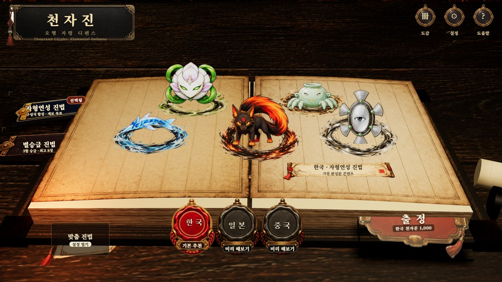
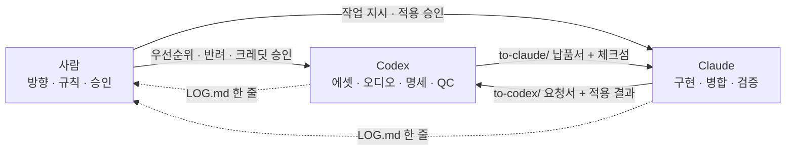

# 천자진 (Thousand Glyphs: Elemental Defense)

[](https://meowthologysaga.github.io/Hanja_Random_TD/)
[](https://github.com/MeowthologySaga/Hanja_Random_TD/actions/workflows/ci.yml)

<!--
  대표 스크린샷 자리. `submission/thumbnail.jpg` 를 저장소에 추가하면 아래
  이미지가 채워진다. 파일이 없는 동안에는 대체 텍스트만 보인다.
-->


> **English** — *Cheonjajin* (천자진) is a browser tower-defense game in which the 1,000 hanja of the Thousand Character Classic become *jaryeong* guardians standing on five 4×4 Wuxing formations. You summon glyphs, fuse three of the same element and star into one random glyph of the next star (up to 8★), align four glyphs in a row, column, or diagonal to auto-seal a four-character idiom, and hold a single looping route for 100 waves across 10 chapters. It is TypeScript on Vite with no game framework: the battlefield is an 880×720 canvas, the main menu is a three.js study scene with a 2D fallback, and the whole app is scaled as one fixed 1280×720 stage. The repository is also the record of a three-way human × Codex × Claude workflow — see [AI 협업 구조](#ai-협업-구조) and `handoff/LOG.md`.

---

## 목차

- [게임 소개](#게임-소개)
- [핵심 규칙 다섯 가지](#핵심-규칙-다섯-가지)
- [처음 5줄로 시작하기](#처음-5줄로-시작하기)
- [AI 협업 구조](#ai-협업-구조)
- [기술 스택과 실행](#기술-스택과-실행)
- [아키텍처 하이라이트](#아키텍처-하이라이트)
- [라이선스와 크레딧](#라이선스와-크레딧)

---

## 게임 소개

한자를 품은 **자령**을 뽑아 오행진에 세우고, 순환 경로를 도는 요괴를 봉인하는 브라우저 타워 디펜스입니다.

전장은 4×4 오행진 다섯 개(북 수진·서 금진·중앙 토진·동 목진·남 화진)로 이루어진 **80칸**입니다. 새 런은 열린 진 없이 시작해 첫 소환 자령과 같은 오행진을 무료로 열고, 나머지 네 진은 원하는 순서로 18·32·52·78엽전에 개방합니다. 경로는 십자 외곽 한 바퀴와 중앙 정사각형 한 바퀴를 잇는 **닫힌 순환로 하나**뿐이고 출구가 없습니다. 적은 네 곳에서 차례대로 나와 처치될 때까지 계속 돌기 때문에, 놓친 적이 그대로 누적 압력이 됩니다. 전장에 적 **80체**가 쌓이거나 매 10웨이브의 우두머리를 제한시간(1장 72초, 장마다 +6초) 안에 처치하지 못하면 즉시 패배하고, 10장 100웨이브를 막으면 승리합니다.

진법(게임 모드)은 시작 화면에서 둘 중 하나를 고릅니다.

| 진법 | 성장 방식 | 위치 |
|---|---|---|
| **별승급 진법** (기본) | 같은 오행·같은 별 3기 → 다음 별 1기 무작위 | 본편 |
| **자형연성 진법** | 실제 한자의 구성식대로 부수를 조립 | 학습 특화 |

한자 범위는 한국 천자문 1,000자(기본 추천), 일본 상용한자 2,136자, 중국 규범한자 3,500자 중에서 고릅니다. 일본·중국은 미리 해보기 단계라 활성 소환 풀이 각각 30자·32자 미리보기 세트이고, 자령 도감과 쉬운 뜻풀이는 한국 천자문에만 갖춰져 있습니다.

## 핵심 규칙 다섯 가지

### 1. 별승급 3합 — 본편 성장 규칙

- 기본 별은 Unicode 17.0.0 Unihan `kTotalStrokes` 의 **실제 획수**로 정해집니다. 천자문 1,000자 기준 1★ 332자 · 2★ 252 · 3★ 167 · 4★ 105 · 5★ 68 · 6★ 33 · 7★ 25 · 8★ 18자로, 획수가 많을수록 드문 피라미드입니다.
- 같은 오행·같은 현재 별 자령 **3기를 고르면 3기가 모두 사라지고**, 같은 오행의 다음 별 자령 1기를 무작위로 얻습니다. 최고 8★입니다.
- 잠금·농축·목표·사자성어 재료로 쓰이는 자령은 3합과 일괄 분해 후보에서 자동으로 빠집니다.
- 별 피해 배율은 1.00 / 1.38 / 1.86 / 2.48 / 3.25 / 4.20 / 5.35 / 6.70이고, 별 하나마다 공격 대기시간 2% 감소와 사거리 +3을 얻습니다. 1★는 기본 공격만 쓰고 2★부터 의미·역할 기술이 열립니다.

### 2. 자형연성 — 학습 진법

- 실제 한자의 구성식을 그대로 씁니다. `木 + 木 → 林` 처럼 같은 글자 두 개가 필요하면 서로 다른 자령 두 기를 소비합니다.
- 조합 방식은 세 가지입니다. **반자동**은 지금 가능한 조합만 제안하고, **목표 자동**은 목표 경로의 조합만 자동 실행하며, **수동**은 선택한 자령이 재료로 쓰이는 조합만 보여 줍니다.
- 목표 계보의 재료만 노리는 **계보 소환**은 이 진법에서만 팔립니다. 12회마다 재료 1기를 보장하고 30회 누적 시 확정 지급합니다.

### 3. 직선 사자성어

- 한 진(4×4) 안의 **직선 한 줄** — 가로 4줄·세로 4줄·대각 2줄 — 네 칸에 성어 글자가 순서대로 놓이면 별도 입력 없이 즉시 봉인됩니다. 역순(4→1)도 인정하며 꺾인 경로는 인정하지 않습니다.
- 봉인 보너스는 그 런이 끝날 때까지 유지되고, 같은 성어는 한 런에 한 번만 봉인됩니다.
- 한국 성어 도감은 이심전심·백발백중·온고지신·유구무언 4개에 천자문 원문 첫 100구를 더한 **104개**이며, 한 런에는 시드가 고른 5개만 등장합니다.
- 화면은 추적 중인 성어 글자의 순번 인장과 다음 글자를 놓을 빈 칸의 금색 점선을 함께 표시합니다.

### 4. 티어 소환 구간제

소환은 별 구간의 **하한**만 후보 풀을 하드로 자릅니다 — 하한 밑의 별은 아예 나오지 않아 "N★ 확정" 광고가 성립합니다. 상한은 소프트입니다: 구간 위의 별도 아주 낮은 잭팟 확률로 8★까지 나오며, 별이 오를수록 확률이 확 떨어집니다. 별승급 진법 전용이며, 후보가 부족한 지역에서는 상품이 노출되지 않습니다.

| 상품 | 별 구간 | 기본가에 얹는 값 |
|---|---|---|
| 기본 · 탐색 · 중복 수집 | 주로 1~3★ | +0 / +2 / +2엽전 |
| 중급 소환 | 2★ 확정 · 주로 2~5★ | +5엽전 |
| 고급 소환 | 3★ 확정 · 3~8★ | +12엽전 |

구간 안에서도 낮은 별이 더 흔하고(별 하나 오를 때마다 ×0.55, `CASUAL_STAR_DECAY`), 상한 위 꼬리는 훨씬 가파릅니다(한 칸마다 ×0.12, `CASUAL_STAR_TAIL_DECAY` — 기본 소환 기준 4★ 1.9% · 5★ 0.23% · 8★ 0.0004%). 티어별 전체 확률표는 게임 내 도움말 소환 갈피와 상품 카드 툴팁에 공개됩니다. 상위 별은 뽑기가 아니라 3합으로 올리는 것이 기본 경로이고, 중급·고급 소환이 그 지름길입니다. 기본 소환가는 `7 + ⌊누적 소환 횟수 / 12⌋` 엽전이며 최대 24입니다. 10연 소환은 10웨이브에 열리고, 별승급 진법에서는 열 장 안에 기본 밴드 상단인 3★ 이상 1기를 보장합니다.

### 5. 오행 공명

한 진에 **그 진의 오행** 자령을 모을수록 그 진의 피해가 오릅니다.

| 그 진의 오행 자령 | 4기 | 8기 | 12기 | 16기 |
|---|---|---|---|---|
| 진 피해 | +6% | +12% | +18% | +25% |

여기에 웨이브 약점 오행 피해 +30%, 水→木→火→土→金→水 상생 배치 보너스가 더해집니다. 자령을 더 키우는 길로는 濃 3단계까지 쌓는 **농축**(연사·지원 역할은 공속 +7.5%/濃, 나머지는 피해 +12%/濃), 5능력치를 99단계까지 올리는 **강화**, 분해 점수 5·15·30에 열려 10단계까지 오르는 오행 고유 특성 3종이 있습니다.

## 처음 5줄로 시작하기

1. **뽑는다** — 상점의 `기본 소환`(<kbd>1</kbd>)으로 자령 한 기를 뽑습니다. 첫 자령의 오행이 이번 런의 시작 오행이 됩니다.
2. **열린다** — 그 오행의 진 하나가 무료로 열리고 빈 칸에 바로 배치됩니다. 여기서 2기쯤 더 뽑아 두는 편이 안전합니다.
3. **시작한다** — 첫 소환 뒤 준비 15초가 흐릅니다. 전장 위 `시작`을 누르면 남은 준비 시간만큼 엽전을 더 받습니다.
4. **움직인다** — 빈 곳을 끌어 화면 이동, 휠로 약 28%~200% 확대·축소, 자령을 끌어 자리 교환. 왼쪽 아래 배율 버튼이 100% 중앙으로 되돌립니다.
5. **단축키** — <kbd>1</kbd> 소환 · <kbd>Q</kbd> 10연 · <kbd>2</kbd> 첫 합성 · <kbd>3</kbd> 인연 연구 · <kbd>Space</kbd> 한자 강조 · <kbd>F</kbd> 배속 1×·2×·3× · <kbd>P</kbd> 일시정지 · <kbd>C</kbd> 도감 · <kbd>M</kbd> 음소거.

## AI 협업 구조

이 저장소는 사람 한 명과, 서로 직접 통신할 수 없는 두 AI 에이전트가 **파일로만** 협업한 기록입니다. 세 역할은 다음과 같이 나뉩니다.



두 에이전트는 서로에게 메시지를 보낼 수 없어서, 저장소의 `handoff/` 폴더를 우편함처럼 씁니다. 한쪽이 폴더에 두면 사람이 상대에게 "확인해봐" 한마디를 전달하는 방식입니다.

**handoff 프로토콜 — 요청서 → 납품서 → 체크섬 → LOG**

| 단계 | 위치 | 내용 |
|---|---|---|
| 1. 요청서 | `handoff/to-codex/` | Claude 가 필요한 에셋을 적는다. 대상 화면·대상 컴포넌트·의도한 표시 크기·투명 배경 여부·9-slice 여백·색 계열·최악 데이터 길이를 채운다. |
| 2. 납품서 | `handoff/to-claude/` | Codex 가 PNG 와 `request.md` 를 넣는다. 상태·트리거·좌표 계약·오류 fallback 명세를 함께 준다. |
| 3. 체크섬 | 납품 폴더 | 전달 전후 파일 해시를 대조한다. LOG 에는 `source/destination 21/21 해시 일치` 처럼 대조 결과를 남긴다. |
| 4. LOG | `handoff/LOG.md` | 양쪽이 주고받은 내역을 한 줄씩 최신순으로 쌓는다. 적용·보류·미해결 판단도 같은 줄에 적는다. |

이미지 원본은 git 에 올리지 않고(`.gitignore`), `handoff/README.md` 와 `LOG.md` 만 추적합니다. 양식과 규칙은 [`handoff/README.md`](handoff/README.md), 실제 왕복 기록은 [`handoff/LOG.md`](handoff/LOG.md) 에 있습니다.

**저장소에서 확인할 수 있는 것** (아래 수치는 이 문단을 쓴 시점의 값이며, 적은 명령으로 언제든 다시 셀 수 있습니다)

- `handoff/LOG.md` 59행 — Codex → Claude 17건, Claude → Codex 8건, 나머지는 Claude 의 구현·병합·확인 기록.
- 커밋 144개 중 121개에 `Co-Authored-By: Claude` 트레일러. `git log --grep='Co-Authored-By: Claude' --oneline | wc -l` 로 셀 수 있습니다.
- 납품이 그대로 채택되지 않은 경우도 남습니다. `p1-p2-polish-assets-pack-v1` 29장 중 실제로 물린 것은 5종이고, 나머지를 보류한 이유(가독성 회귀·기존 에셋과 중복·회귀 위험)가 같은 줄에 적혀 있습니다.

## 기술 스택과 실행

TypeScript 7 · Vite 8 · three.js 0.185 · Vitest 4 · Playwright 1.62. 게임 엔진·물리·UI 프레임워크는 쓰지 않고 Canvas 2D 와 DOM 으로 직접 그립니다.

```bash
npm ci
npm run dev        # http://127.0.0.1:4437/
```

| 명령 | 하는 일 |
|---|---|
| `npm run dev` | 개발 서버 (127.0.0.1:4437) |
| `npm run build` | 타입 검사 → Vite 빌드 → 정적 산출물을 `dist/client` 로 재배치 |
| `npm test` | Vitest 단위 테스트 (`tests/` 17개 스펙) |
| `npm run validate:data` | 한자·레시피·읽기 데이터 정합성 검사 |
| `npm run simulate -- --runs=90` | 자동 플레이 시뮬레이션으로 규칙 안정성 확인 |
| `npm run test:e2e` | Playwright E2E (`e2e/smoke.spec.ts`, `e2e/audio.spec.ts`) |
| `npm run check` | `audit:huneum → validate:data → test → simulate --runs=45 → build` 를 한 번에 |

CI(`.github/workflows/ci.yml`)는 push·PR 마다 `validate:data → test → simulate --runs=15 → build` 를 돌리고, `main` 에 들어간 변경은 `deploy-pages.yml` 이 GitHub Pages 로 배포합니다.

## 아키텍처 하이라이트

- **고정 무대 1280×720** — 앱 전체를 `#stage` 한 장에 담아 무대째 균일 확대·축소하고 남는 자리는 레터박스로 둡니다. 어떤 창 크기에서도 같은 그림이 배율만 다르게 보입니다. (`src/ui/stage.ts`)
- **전장 캔버스 880×720 + 명령 패널 400px** — 전투 렌더링은 Canvas 2D 한 장, 정보·조작은 DOM 입니다. 두 좌표계가 같은 설계 해상도를 공유합니다. (`src/core/content.ts`)
- **우선순위 프리로더** — 타이틀 화면에 필요한 P1 에셋을 먼저 받아 부팅 막을 걷고, 전투용 P2 를 뒤에서 채웁니다. 벽시계가 아니라 "바이트 흐름이 끊겼는가"로 막을 걷습니다. (`src/ui/asset-loader.ts`)
- **서비스 워커** — 문서는 network-first 로 새 배포를 놓치지 않고, `/assets/` 는 cache-first + 백그라운드 갱신입니다. 캐시 키가 빌드 ID(`sw.js?v=…`)라 새 빌드가 옛 캐시를 통째로 지웁니다. 오디오 탐색의 Range 요청은 건드리지 않습니다. (`public/sw.js`)
- **WebP 3단 폴백** — three.js 서재 텍스처는 WebP 를 먼저 받고, 실패하면 PNG, 그마저 실패하면 절차 생성 재질로 내려갑니다. 어느 단계에서도 화면이 비지 않습니다. (`src/ui/menu3d.ts`)
- **결정론 시드** — 같은 시드·같은 지역·같은 진법이면 같은 소환과 같은 능력이 나옵니다. 능력은 일곱 축(오행 × 뜻 계열 × 조준 우선순위 × 전투 역할 × 조합망 역할 × 부모 오행 계승 × 성장·농축 단계)을 결정론적으로 합성해 만듭니다. (`ABILITY_SYSTEM.md`)

## 라이선스와 크레딧

- **그래픽** — 자령·적 스프라이트, 지도·UI 그래픽은 이 프로젝트를 위해 Codex 가 제작했습니다. 이용 경계는 [`ASSET_RIGHTS.md`](ASSET_RIGHTS.md) 를 따릅니다.
- **오디오** — BGM 6곡과 효과음 25종은 저장소 소유자가 승인한 작업공간에서 **Suno 로 생성**한 뒤 로컬에서 정규화했습니다. 생성 프롬프트와 Suno 원본 ID 는 `src/data/audio-manifest.json`, 변환·검사 기록은 `public/assets/audio/audio-qc.json` 에 보존합니다.
- **제3자 데이터** — 한자 읽기·부수·획수는 Unicode Unihan 17.0.0, 한국어 훈음은 libhangul, 쉬운 뜻풀이는 국립국어원 한국어기초사전, 천자문 독음 교차 확인은 한국어 위키문헌에서 왔습니다. 고정 커밋·SHA-256·이용 조건은 [`THIRD_PARTY_NOTICES.md`](THIRD_PARTY_NOTICES.md) 에 기록했습니다.
- **런타임 의존성** — three.js (MIT). 그 밖에는 개발 의존성만 사용합니다.
- **독자화 경계** — 랜덤 타워 디펜스 장르의 플레이 감각만 참고했습니다. 다른 상용 게임의 코드·맵·명칭·이미지·사운드를 포함하지 않습니다.

## 더 읽을 것

- 설계 문서 [`GAME_DESIGN.md`](GAME_DESIGN.md) · 능력 합성 규칙 [`ABILITY_SYSTEM.md`](ABILITY_SYSTEM.md) · 버전별 결정 기록 [`docs/design/`](docs/design/)
- 공개 저장소의 `handoff_source/` 에는 실행에 필요한 압축 매니페스트와 지역별 `*.runtime.json` 만 포함합니다. 원본 인수 문서·검토표·로컬 경로 정보는 공개하지 않습니다.
- 로컬 개발 서버 런처 소스는 `tools/dev-server-launcher/Program.cs` 에 있고 `build.ps1` 로 단일 EXE 를 만들 수 있습니다. 생성된 EXE 는 저장소에 넣지 않습니다.
