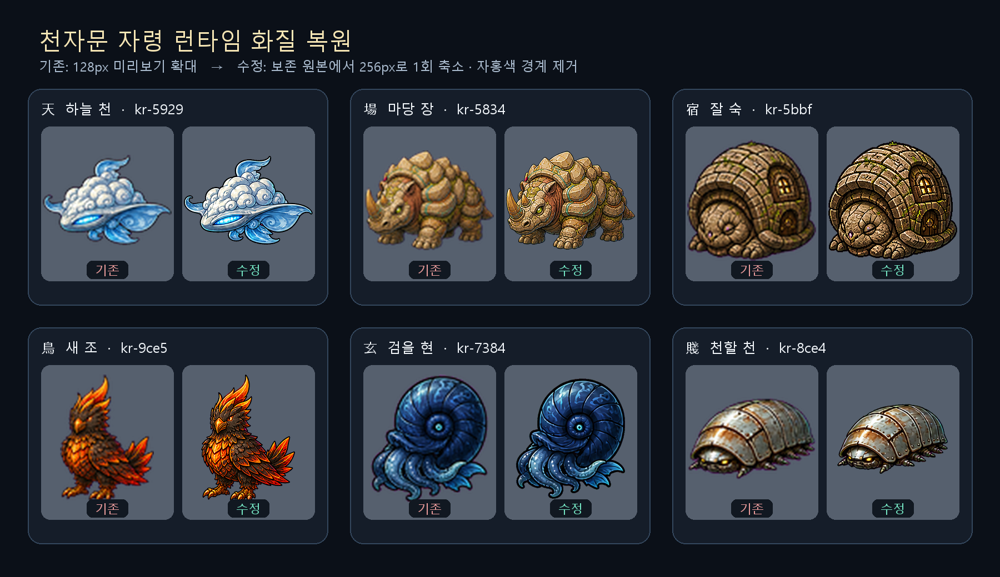

# v0.32 천자문 자령 런타임 화질 감사

## 원인

새 제작 자령의 보존 원본은 대부분 1,254×1,254 크기의 2×2 시트였지만, 기존 런타임 빌더는 먼저 128×128 검토용 프레임으로 축소된 PNG를 읽었다. 실제 자령 내용은 흔히 긴 변 80px 안팎만 남았고, 이를 256×256 런타임 캔버스에서 최대 232px까지 다시 키워 흐림과 계단 현상이 생겼다.

대표적으로 `天`은 원본 사분면에서 356×246px인 자령을 128px 검토 프레임의 81×57px까지 줄인 뒤 약 2.86배 확대하고 있었다.

또한 플레이어 도감 1,000개 중 상세 기록이 있던 360개는 전투용 런타임 경로가 아니라 별도의 128×128 `assets/codex` 복사본을 참조했다. 따라서 런타임만 복원해도 도감의 큰 204px 초상에서는 이전 저화질이 계속 보였다.

## 수정

- 제작 원본과 배치 매니페스트를 ID로 다시 연결해 해당 2×2 사분면에서 직접 추출한다.
- 256×256 RGBA 캔버스 안의 최대 232px로 한 번만 축소하며 원본보다 크게 확대하지 않는다.
- 외곽에 섞인 `#ff00ff` 크로마 색을 2px 경계에서 색-알파로 복원한다.
- 전투·상점·플레이어 도감 1,000개가 모두 같은 `assets/jaryeongs/cheonjamun-runtime-v1` 고화질 경로를 사용한다. 기존 128px 도감 복사본은 역사 자료를 위해 남기되 게임에서는 참조하지 않는다.
- 원본 제작물·실패 증거·QC 판정은 수정하지 않는다. 런타임은 계속 `approved: 0`, `playable-preview`다.

## 결과

| 검사 | 결과 |
|---|---:|
| 런타임 PNG | 1,000 / 1,000 |
| 보존 원본 직접 복원 | 897 |
| 기존 원본 프레임 직접 사용 | 101 |
| 고해상도 처리본 대체 사용 | 2 (`寸`, `士`) |
| 원본 확대 | 0 |
| 최소 캔버스 여백 | 12px |
| SHA-256·256×256 RGBA·알파 검사 오류 | 0 |

두 대체 항목도 각각 긴 변 399px와 401px인 처리본을 232px로 축소하므로 재확대 문제는 없다. 보존 원본 직접 복원 897개를 기존 런타임과 비교한 라플라시안 분산 선명도 지표는 중앙값 85.418배였고 897개 모두 상승했다. 이 수치는 지각 품질 점수가 아니라 흐림 감소를 확인하는 공학적 보조 지표다.



## 재검증

```powershell
python scripts/verify-cheonjamun-runtime-assets.py
```

검증기는 1,000개 ID·PNG 수, 매니페스트 해시, 256×256 RGBA, 비어 있지 않은 알파, 안전 여백, 확대 금지, 품질 경로와 데이터 매핑을 함께 확인한다.
