# v037 자령 일러스트 감사 — 훈·뜻 부합 / 그림체 / 품질

천자문 1,000자 자령 일러스트(`public/assets/jaryeongs/cheonjamun-runtime-v1/`)를 **사람 눈 기준**으로 넷으로 갈랐다. 재생성 여부를 정하는 근거 문서다.

## 방법

- 판정자 10명이 100자씩 256px 원본 접촉 시트로 보고, 글자마다 「그림만 보고 훈(뜻)에 닿는가」「같은 그림체인가」「그림 자체에 결함이 없는가」를 적었다 — 1차 231자 걸림.
- 걸린 231자를 검증자 4명이 확대해 다시 보고 유지·기각·정정했다 — 25자 기각(뜻이 통한다고 봄), 몇 자는 판정이 바뀜(예: 뜻모호 → 품질불량). **최종 210자**.
- 그림체는 1,000자 거의 전부 같은 「오행 크리처」 화풍이다 — 그림체 이탈은 1건. 통일성은 문제가 아니다. 문제는 **뜻이 안 읽히는 것**(158자)과 **배경 자국**(품질불량 55자의 대부분)이다.

## 요약

| 판정 | 글자 수 | 뜻 |
|---|---:|---|
| 뜻불일치 | 5 | 훈과 다른 것을 그렸다 — 보면 다른 뜻이 먼저 읽힌다 |
| 품질불량 | 55 | 그림 자체의 결함 — 배경 자국(자홍 키잉 잔여)·잘림·뭉개짐 |
| 그림체이탈 | 1 | 다른 화풍·다른 렌더 — 1,000자 가운데 튀는 그림 |
| 뜻모호 | 158 | 그림만 보고 훈에 닿을 단서가 없다 — 오행 크리처로는 읽히지만 그 글자로는 안 읽힌다 |
| 통과 | 790 | 그림만 보고 훈에 닿거나, 관련 상징이 또렷하다 |

오행별 걸림: 土 36 · 木 69 · 水 43 · 火 33 · 金 29

**품질불량의 대부분은 같은 결함**이다 — 발밑에 자홍색(#ff00ff 계열) 크로마키 잔여가 남아 있다. 이것은 재생성이 아니라 **키잉 재처리**로 고칠 수 있다(아래 목록의 메모에 「자홍색 배경 자국」으로 적혀 있다).

## 뜻불일치 — 5자

훈과 다른 것을 그렸다 — 보면 다른 뜻이 먼저 읽힌다.

| # | 그림 | 한자 | 훈음 | 오행 | 쉬운 뜻 | 무엇이 그려져 있나 · 왜 걸렸나 | 검증 메모 |
|---:|---|---|---|---|---|---|---|
| 199 | 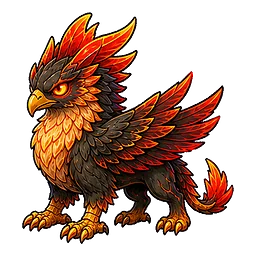 | **羔** | 새끼양 고 | 火 | 아직 다 자라지 않은 어린 양을 뜻합니다 | 독수리 머리·사자 몸·날개의 불꽃 그리핀 — 새끼양이 아님 | 독수리 머리·사자 몸·날개의 불꽃 그리핀. 양 요소 전혀 없음 — 뜻불일치 확정 |
| 501 | 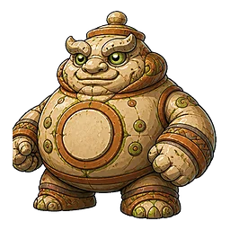 | **家** | 집 가 | 土 | 사람이나 동물이 추위나 더위 등을 막고 그 속에 들어 살기 위해 지은 건 | 뚱뚱한 돌 거인(항아리 같은 둥근 배, 뚜껑 모양 머리) — 지붕·문 등 집 요소가 전혀 없음 | 뚜껑 꼭지 머리에 항아리 배의 뚱뚱한 돌 거인 — 지붕·문·벽 없이 '항아리'로 읽히므로 다른 사물 그림. 동의 |
| 527 | 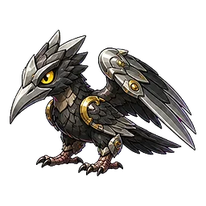 | **刻** | 새길 각 | 金 | 그림이나 글씨 등을 파다 | 칼날 날개 검은 까마귀 — '새길'을 새(鳥)로 오독한 그림 | 칼날 날개 까마귀 — 銘과 나란히 '새길'을 새(鳥)로 오독한 짝, 동의 |
| 528 | 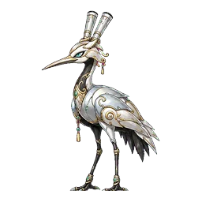 | **銘** | 새길 명 | 金 | 그림이나 글씨 등을 파다 | 은빛 두루미 — '새길'을 새(鳥)로 오독한 그림 | 은빛 두루미 — 새김 요소 전무, 새(鳥) 오독, 동의 |
| 626 | 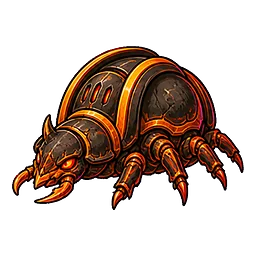 | **門** | 문 문 | 火 | 사람이 안과 밖을 드나들거나 물건을 넣고 꺼낼 수 있게 하기 위해 열고  | 검붉은 딱정벌레(주황 집게·다리) — 문 요소가 없고 벌레(蟲)로 읽힌다. 등딱지 두 짝을 문짝으로 노렸을 수 있으나 안 통한다 | 검붉은 딱정벌레 — 등딱지 가운데 갈라짐을 문짝으로 노렸어도 벌레로만 읽힌다. 蟲 계열 그림으로 보인다. |

## 품질불량 — 55자

그림 자체의 결함 — 배경 자국(자홍 키잉 잔여)·잘림·뭉개짐.

| # | 그림 | 한자 | 훈음 | 오행 | 쉬운 뜻 | 무엇이 그려져 있나 · 왜 걸렸나 | 검증 메모 |
|---:|---|---|---|---|---|---|---|
| 8 | 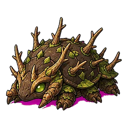 | **荒** | 거칠 황 | 木 | 땅이 거칠고 황폐해 사람이 살거나 농사짓기 어려운 상태를 뜻합니다 | 마른 가지 가시가 돋은 거친 흙 거북 — 발밑에 키잉 안 된 자홍색 배경 자국이 남아 있음 | 마른 가지·가시 돋은 흙 거북, 거칠다는 뜻은 통함. 발밑 자홍색 키잉 잔여 확인(자홍 픽셀 810개) — 품질불량 유지 |
| 24 | 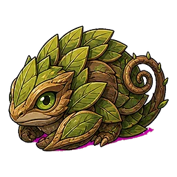 | **藏** | 감출 장 | 木 | 보거나 찾지 못하도록 가리거나 숨기다 | 잎사귀 속에 몸을 말아 숨은 초록 도마뱀(뜻은 맞음) — 발밑에 자홍색 배경 자국 남음 | 잎 속에 숨은 도마뱀으로 뜻은 통함. 발밑 자홍색 잔여 확인(280픽셀, 옅지만 보임) |
| 60 | 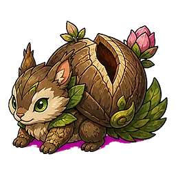 | **柰** | 능금나무 내 | 木 | 능금이나 사과와 비슷한 열매가 열리는 나무를 뜻합니다 | 갈라진 열매 껍질 속 다람쥐(참조판 그림) — 발밑에 자홍색 배경 자국 남음 | 참조판과 같은 열매 속 다람쥐 그림. 발밑 자홍색 잔여 확인(674픽셀) — 참조판에도 같은 자국이 찍혀 있음 |
| 64 | 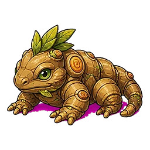 | **薑** | 생강 강 | 木 | 매운 맛과 향이 나서 양념이나 차의 재료, 한약재 등으로 쓰이는 울퉁불퉁 | 생강 뿌리 몸통의 도마뱀(뜻은 맞음) — 발밑에 자홍색 배경 자국 남음 | 생강 뿌리 도마뱀으로 뜻은 통함. 발밑 자홍색 잔여 확인(835픽셀) |
| 347 | 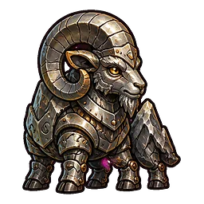 | **伯** | 맏 백 | 金 | 형제 가운데 맏이나 아버지의 형인 큰아버지를 뜻합니다 | 큰 뿔의 은빛 갑옷 숫양(맏이로 읽힘); 앞다리 사이 배 아래에 자홍색 얼룩 잔여물이 남아 있다 | 큰 뿔 갑옷 숫양은 맏이로 닿음. 앞다리 사이 자홍 잔여 20px 확인(작지만 보임). 동의 |
| 450 | 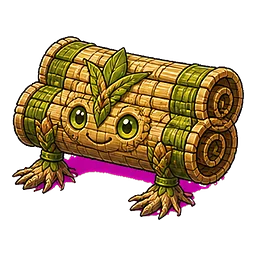 | **筵** | 대자리 연 | 木 | 대나무로 엮은 긴 자리를 뜻하며, 그 자리를 펴는 잔치에도 씁니다 | 둘둘 만 대나무 자리에 얼굴 — 뜻은 맞으나 바닥에 넓은 자홍색 배경 잔여(1226px)가 남았다 | 둘둘 만 대자리 얼굴은 뜻에 맞음. 바닥 자홍 배경 1226px 넓게 남음 확인, 동의 |
| 456 | 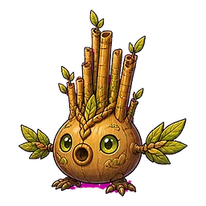 | **笙** | 생황 생 | 木 | 여러 개의 가는 관을 꽂아 입으로 부는 전통 관악기인 생황을 뜻합니다 | 양파형 몸에서 대나무 관이 여러 개 솟은 생황 — 뜻은 맞으나 관 사이·발밑에 자홍색 잔여(191px)가 보인다 | 박통에 대나무 관 솟은 생황, 뜻 정확. 발밑·관 사이 자홍 191px 확인, 동의 |
| 463 | 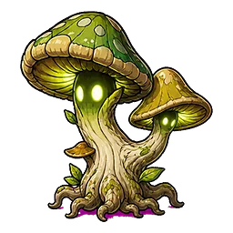 | **疑** | 의심할 의 | 木 | 불확실하게 여기거나 믿지 못하다 | 빛나는 눈 달린 버섯 두 개와 뿌리 — 의심 상징 없음, 뿌리 밑에 자홍색 잔여(99px) | 빛나는 눈 버섯 둘 — 의심 표지 없음, 뿌리 밑 자홍 99px 확인, 동의 |
| 474 | 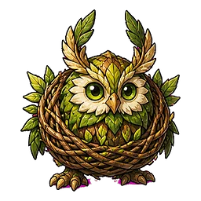 | **集** | 모일 집 | 木 | 따로 있는 것이 한데 합쳐지다 | 엮은 가지 둥지 속 잎 올빼미 한 마리 — 새+나무 자원은 닿으나 「모이다」가 안 보인다, 발밑 자홍 점 소량 | 둥지 속 잎 올빼미 한 마리 — 새+나무 자원은 맞으나 '모임'이 없음. 발톱 아래 자홍 잔여 51px(伯의 20px보다 큼)이 선으로 보여 품질불량 추가 |
| 536 | 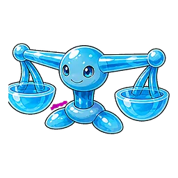 | **衡** | 저울대 형 | 水 | 저울에서 무게를 재는 가로 막대를 뜻하며, 서로 비교해 판단한다는 뜻으로 | 파란 젤리 양팔저울 — 받침 사이에 자홍 배경 잔재 얼룩(256px 에서도 보임) | 파란 젤리 양팔저울, 뜻 정확. 받침 사이 자홍 115px 확인, 동의 |
| 576 | 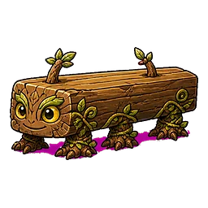 | **橫** | 가로 횡 | 木 | 왼쪽에서 오른쪽으로 이어지는 방향. 또는 그 길이 | 가로 누운 통나무 — 밑바닥에 자홍 배경 잔재가 뚜렷 | 가로 통나무는 뜻 통함. 밑바닥 자홍 띠 3.3%로 또렷. |
| 581 | 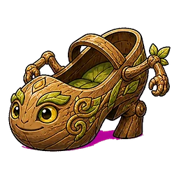 | **踐** | 밟을 천 | 木 | 어떤 대상 위에 발을 올려놓고 누르다 | 나무 신발 — 밑바닥에 자홍 배경 잔재가 뚜렷 | 나무 신발은 뜻 통함. 밑바닥 자홍 잔재 1.7% 뚜렷. |
| 595 | 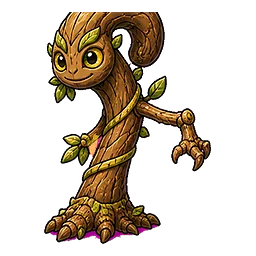 | **頗** | 비뚤어질 파 | 木 | 모양이나 방향, 위치가 곧거나 바르지 않고 한쪽으로 기울어지거나 쏠리다 | 비뚤어진 나무 — 뿌리 밑 자홍 배경 잔재 | 비뚤어진 나무는 뜻 통함. 뿌리 밑 자홍 0.9%, 1배에서도 밑동에 자홍 기운이 보인다. 林·疏·索과 같은 급. |
| 643 | 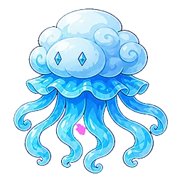 | **緜** | 햇솜 면 | 水 | 부드러운 솜을 뜻하며, 가늘고 길게 끊이지 않고 이어진다는 뜻도 있습니다 | 솜구름 머리에 실 촉수의 해파리 — 뜻은 통하나 촉수 한가운데 자홍 얼룩 하나가 남아 있다 | 솜구름 해파리는 뜻 통함. 촉수 한가운데 자홍 얼룩 하나가 1배에서도 분홍 점으로 보인다(0.5%, 몸 안쪽이라 눈에 띔). |
| 672 | 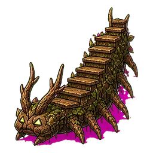 | **陟** | 오를 척 | 木 | 사람, 동물 등이 낮은 곳에서 높은 곳이나 아래에서 위로 움직이다 | 등에 계단이 오르는 나무 애벌레 — 뜻은 통하나 발밑에 자홍 배경 얼룩이 넓고 지저분하게 남았다(자홍 6.5%, 참조판 1%) | 계단 애벌레는 뜻 통함. 자홍 9.1%로 60자 중 최악, 발밑 전체가 자홍. |
| 679 | 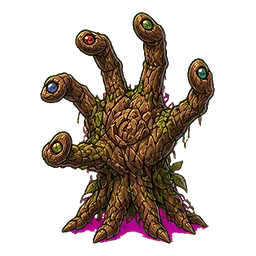 | **秉** | 잡을 병 | 木 | 손으로 쥐고 놓지 않다 | 손가락 끝마다 눈이 달린 나무 손이 움켜쥔다 — 뜻은 통하나 손목·손가락 사이에 자홍 얼룩과 발밑 자홍 잔여가 남았다 | 움켜쥔 나무 손은 뜻 통함. 손목·손가락 사이와 발밑 자홍 3.5%. |
| 704 | 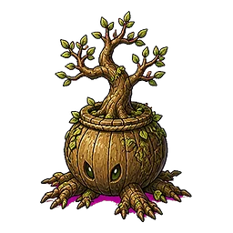 | **植** | 심을 식 | 木 | 풀이나 나무 등의 뿌리나 씨앗을 흙 속에 묻다 | 얼굴 달린 흙 화분에 심긴 작은 나무 — 뜻은 맞음 / 바닥에 자홍색 크로마 잔여 띠 | 화분에 심긴 나무는 뜻 통함. 화분 밑 자홍 1.8%. |
| 705 | 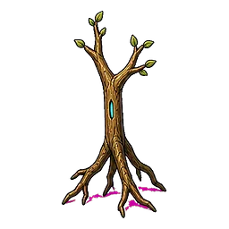 | **省** | 덜 생 | 木 | 일정한 수량이나 부피에서 일부를 떼어 내다 | 잎 거의 없는 앙상한 나무, 줄기에 청록 보석 눈 — '덜'로 안 읽힘 / 바닥 자홍 띠 | 앙상한 나무 — 줄기 눈 보석은 작아 '살필 성'으로도 안 짚히고 '덜'은 더 안 읽힌다. 바닥 자홍 3.7%. |
| 712 | 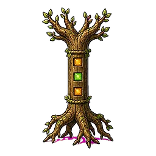 | **極** | 가운데 극 | 木 | 더 나아갈 수 없는 맨 끝이나 가장 높은 정도, 지구의 북극과 남극을 뜻 | 곧은 기둥 줄기 한가운데 보석 셋 박힌 나무 — '가운데'가 안 짚힘, 그냥 기둥 나무 / 뿌리 밑 자홍 띠 | 기둥 나무 — 極의 용마루 어원은 너무 후미지고 '가운데'로 안 짚힌다. 뿌리 밑 자홍 1.7%. |
| 717 | 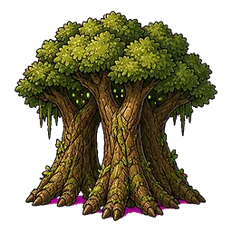 | **林** | 수풀 림 | 木 | 나무나 풀이 빽빽하게 많이 나 있는 곳 | 여러 그루가 붙어 자란 초록 숲 덩어리 — 뜻 맞음 / 바닥 자홍 띠 | 숲 덩어리는 뜻 통함. 바닥 자홍 0.7%, 1배에서 밑동에 띠가 보인다. |
| 722 | 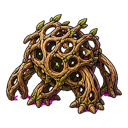 | **疏** | 뚫릴 소 | 木 | 막힌 것을 뚫거나 사이가 성기고 멀어진 상태를 뜻합니다 | 구멍 숭숭 뚫린 나뭇가지 격자 괴물 — 뜻 맞음 / 바닥 자홍 띠 | 구멍 뚫린 격자 괴물은 뜻 통함. 바닥 자홍 1.0%. |
| 729 | 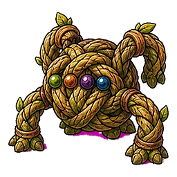 | **索** | 동아줄 삭 | 木 | 굵고 튼튼하게 꼰 줄 | 굵은 밧줄 감은 거미 — 뜻 맞음 / 바닥 자홍 띠 | 밧줄 거미는 뜻 통함. 바닥 자홍 1.1%. |
| 734 | 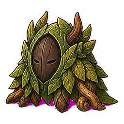 | **默** | 묵묵할 묵 | 木 | 말을 하지 않고 소리 없이 조용히 있는 상태를 뜻합니다 | 입 없는 나무 가면이 잎 속에 숨음 — 뜻 맞음 / 바닥 자홍 띠 | 입 없는 나무 가면은 뜻 통함. 바닥 자홍 2.0%. |
| 739 | 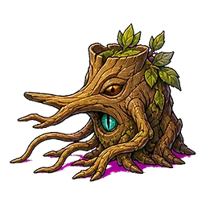 | **尋** | 찾을 심 | 木 | 무엇을 얻거나 누구를 만나려고 여기저기를 살피다. 또는 그것을 얻거나 그 | 큰 눈으로 두리번대는 나무 그루터기 — 뜻 맞음 / 바닥 자홍 띠 | 두리번대는 그루터기는 뜻 통함. 바닥 자홍 2.3%. |
| 754 | 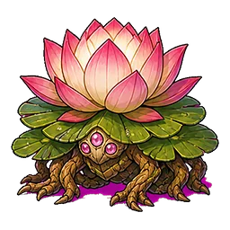 | **荷** | 연 하 | 木 | 잎이 크고 둥글며 붉은색 또는 흰색의 커다란 꽃이 물 위에 떠서 피는,  | 연꽃 괴물 — 뜻 맞음 / 바닥 자홍 띠 뚜렷 | 연꽃 괴물은 뜻 통함. 바닥 자홍 3.3%. |
| 758 | 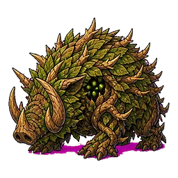 | **莽** | 우거질 망 | 木 | 풀이나 나무 등이 자라서 무성해지다 | 빽빽한 덤불 덩어리 — 뜻 맞음 / 바닥 자홍 띠 뚜렷 | 덤불 덩어리는 뜻 통함. 바닥 자홍 2.5%. |
| 760 | 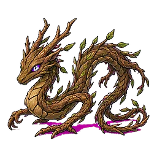 | **條** | 가지 조 | 木 | 나무에서 뻗은 가는 가지나 길고 가느다란 줄, 글의 한 조항을 뜻합니다 | 잔가지로 된 나무 용 — 뜻 맞음 / 바닥 자홍 띠 | 잔가지 나무 용은 뜻 통함. 바닥 자홍 3.3%. |
| 761 | 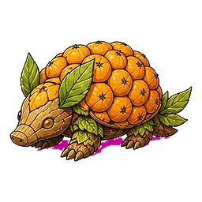 | **枇** | 비파나무 비 | 木 | ‘杷’와 함께 써서 노란 열매가 열리는 비파나무를 뜻합니다 | 주황 비파 열매 덮인 고슴도치 — 뜻 맞음 / 바닥 자홍 띠 | 비파 열매 고슴도치는 뜻 통함. 바닥 자홍 1.9%. |
| 765 | 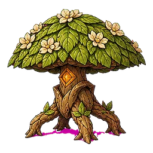 | **梧** | 머귀나무 오 | 木 | 잎이 크고 목재로도 쓰는 벽오동과 오동나무 종류를 뜻합니다 | 흰 꽃 핀 큰 잎 나무 — 뜻 맞음 / 바닥 자홍 띠 | 흰 꽃 큰 잎 나무는 뜻 통함. 바닥 자홍 1.8%. |
| 766 | 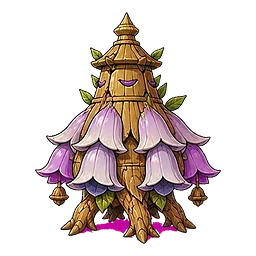 | **桐** | 오동나무 동 | 木 | 높이는 15m 정도이고 잎이 아주 크고 둥근, 가구나 악기를 만드는 데에 | 보라 종 꽃(오동꽃) 나무 탑 — 뜻 맞음 / 바닥 자홍 띠가 이 슬라이스에서 가장 짙음 | 오동꽃 나무 탑은 뜻 통함. 바닥 자홍 4.5%로 陟 다음으로 짙다. |
| 770 | 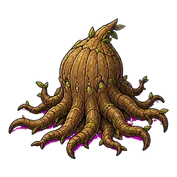 | **根** | 뿌리 근 | 木 | 땅속으로 뻗어서 물과 양분을 빨아올리고 줄기를 지탱하는 식물의 한 부분 | 뿌리 덩어리 괴물 — 뜻 맞음 / 바닥 자홍 띠 | 뿌리 괴물은 뜻 통함. 바닥 자홍 2.2%. |
| 771 | 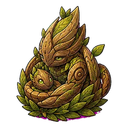 | **委** | 맡길 위 | 木 | 어떤 일을 책임지고 처리하게 내주다 | 잎 둥지에서 새끼를 품은 나무 뱀 — 맡김으로 읽힘 / 바닥 자홍 띠 작음 | 새끼 품은 나무 뱀은 맡김으로 통함. 바닥 자홍 0.55%로 얇지만 확대하면 밑선이 자홍으로 보인다 — 경계선 급. |
| 791 | 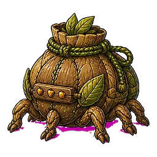 | **囊** | 주머니 낭 | 木 | 돈이나 물건 등을 넣어 가지고 다닐 수 있도록 천이나 가죽 등으로 만든  | 밧줄로 묶은 자루 괴물 — 뜻 맞음 / 바닥 자홍 띠 | 자루 괴물 뜻 좋음. 발밑 자홍 띠 뚜렷(607px). 매트 정리만 필요 |
| 809 | 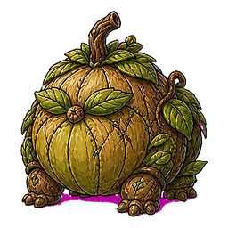 | **飽** | 배부를 포 | 木 | 배가 차서 더 먹고 싶지 않은 상태이다 | 잎 달린 둥근 호박 몸(배부름 OK) — 발밑에 자홍색 그림자 잔여 | 둥근 호박 몸 뜻 좋음. 발밑 자홍 그림자(492px) 확인 |
| 815 | 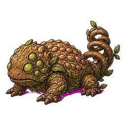 | **糟** | 지게미 조 | 木 | 술을 거르고 남은 찌꺼기인 지게미를 뜻합니다 | 누런 찌꺼기 덩어리 두꺼비, 나선 꼬리 — 발밑 자홍색 잔여 | 찌꺼기 두꺼비 뜻 무난. 발밑 자홍 잔여(303px) 확인 |
| 816 | 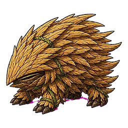 | **糠** | 겨 강 | 木 | 벼, 보리 등의 곡식을 찧을 때 벗겨져 나오는 얇은 껍질 | 왕겨 껍질로 뒤덮인 고슴도치 — 발밑 자홍색 선 잔여 | 왕겨 고슴도치 좋음. 앞발 밑 자홍 선(95px) 원본 크기에서도 보임 |
| 831 | 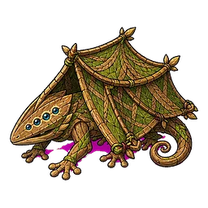 | **帷** | 휘장 유 | 木 | 넓은 천을 여러 폭으로 이어서 주위를 빙 둘러치는 막 | 천막 휘장을 두른 도마뱀 — 발밑 자홍색 잔여 | 휘장 두른 도마뱀 뜻 좋음. 발밑 자홍(396px) 확인 |
| 846 | 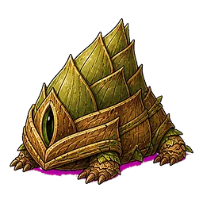 | **筍** | 죽순 순 | 木 | 대나무의 땅속줄기에서 돋아나는 어린싹 | 눈 달린 죽순 껍질 짐승 — 발밑 자홍색 잔여 | 죽순 껍질 짐승 뜻 좋음. 발밑 자홍(438px) 확인 |
| 854 | 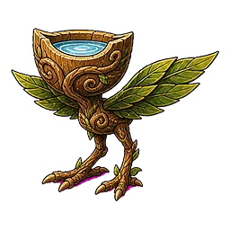 | **杯** | 잔 배 | 木 | 물이나 차 등을 따라 마시는 작은 그릇 | 물 담긴 나무 잔에 잎·새다리 — 발끝에 작은 자홍색 점 잔여 | 나무 잔 뜻 좋음. 왼발 밑 자홍 점(49px) 미세하나 원본 크기에서 보임 — 매트 정리 대상 |
| 859 | 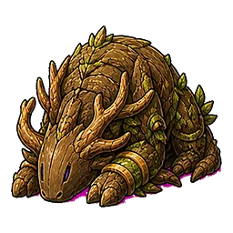 | **頓** | 조아릴 돈 | 木 | 존경의 뜻을 나타내거나 사정을 하느라 바닥에 이마가 닿을 정도로 머리를  | 머리 땅에 조아린 나무 사슴(뜻 OK) — 배 밑 자홍색 잔여 | 조아린 나무 사슴 뜻 좋음. 배 밑 자홍(143px) 확인 |
| 873 | 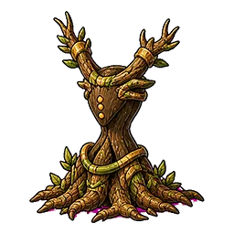 | **稽** | 머무를 계 | 木 | 움직임을 멈추어 머물거나 자세히 살피는 것을 뜻하며, 이마를 땅에 대어  | 뿌리 깊이 내린 나무 그루터기(머무름 OK) — 뿌리 끝에 작은 자홍색 점 | 뿌리 깊은 그루터기 뜻 좋음. 뿌리 끝 자홍 점(47px) 미세 — 매트 정리 대상 |
| 874 | 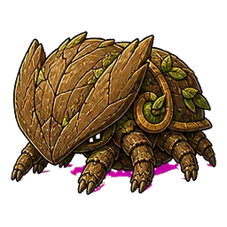 | **顙** | 이마 상 | 木 | 얼굴의 눈썹 위부터 머리카락이 난 아래까지의 부분 | 널찍한 이마 판 덮어쓴 나무 짐승 — 발밑 자홍색 잔여 | 넓은 이마 판 짐승 뜻 무난. 발밑 자홍(442px) 확인 |
| 883 | 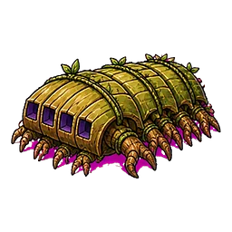 | **簡** | 대쪽 간 | 木 | 대나무의 줄기를 쪼갠 조각 | 대쪽 마디 몸통 애벌레 — 발밑 자홍색 크게 잔여 | 대쪽 마디 애벌레 뜻 무난. 발밑 자홍 크게(750px) 확인 |
| 884 | 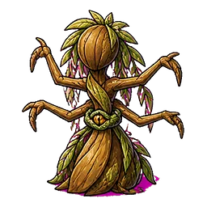 | **要** | 구할 요 | 木 | 필요한 것을 얻으려고 찾다. 또는 찾아서 얻다 | 허리 잘록한 나무 인형(要=허리 원뜻) — 발밑 자홍색 잔여 | 잘록한 허리 나무 인형(要 원뜻 허리) 뜻은 봐줄 만함. 발밑 자홍(262px) 확인 |
| 886 | 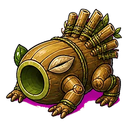 | **答** | 젖을 답 | 木 | 물음이나 요청에 맞는 말이나 행동으로 대답하는 것을 뜻합니다 | 대통 몸통 짐승 — '대답' 상징 없음; 발밑 자홍색 크게 잔여(훈음 '젖을 답'도 의심) | 대통 몸통 — 대답 표지 없음. 발밑 자홍 매우 큼(1122px). 훈음 '젖을 답'은 데이터 오류로 보임(대답할 답) |
| 895 |  | **願** | 하고자할 원 | 木 | 마음속으로 어떤 일이 이루어지기를 바라는 것을 뜻합니다 | 잎 문양 씨앗 알에 발 달림 — 바람·소원 상징 없음; 발밑 자홍색 잔여 | 잎 문양 씨앗 알 — 바람·소원 표지 없음. 발밑 자홍(710px) 확인 |
| 900 |  | **特** | 우뚝할 특 | 木 | 두드러지게 높이 솟아 있는 상태이다 | 높이 솟은 뿔 나무 짐승(우뚝함 OK) — 발밑 자홍색 잔여 | 높이 솟은 뿔 짐승 뜻 좋음. 발밑 자홍(189px) 확인 |
| 902 |  | **躍** | 뛸 약 | 木 | 몸을 위로 높이 솟게 하다 | 나뭇잎 날개 메뚜기가 뒷다리 접고 도약 자세 — 뜻은 맞으나 발밑에 자홍(마젠타) 배경 띠가 256px에서도 보임(잔여 225px) | 도약 자세 메뚜기 뜻 좋음. 발밑 자홍 띠(256px) 뚜렷 |
| 929 |  | **釋** | 풀 석 | 木 | 묶인 것을 풀어 놓거나 어려운 뜻을 알기 쉽게 설명하는 것을 뜻합니다 | 매듭 풀리는 외눈 밧줄 뱀 — 뜻 통하나 밑에 자홍 배경 띠 뚜렷(369px) | 매듭 풀리는 밧줄 뱀 뜻 좋음. 밑 자홍 띠(590px) 확인 |
| 933 |  | **並** | 나란할 병 | 木 | 줄을 선 모양이 나오고 들어간 곳이 없이 고르고 가지런하다 | 나란히 선 두 그루 나무 — 뜻 좋으나 밑동에 자홍 배경 띠(392px) | 나란한 두 그루 뜻 좋음. 밑동 자홍(585px) 확인 |
| 936 |  | **妙** | 묘할 묘 | 木 | 모양이나 동작 등이 색다르고 신기하다 | 씨앗 머리에 가지 팔 여럿 달린 나무 정령 — 아무 木 글자에나 붙을 일반 크리처 | 뜻모호 동의(일반 나무 정령). 첫 판정이 놓친 것: 발밑에 자홍 잔여(161px)가 원본 크기에서도 보임 — 품질불량 추가 |
| 977 |  | **束** | 묶을 속 | 木 | 끈이나 줄 등을 매듭으로 만들다 | 덩굴 밧줄로 칭칭 묶인 나무소 — 뜻 좋으나 발밑 자홍 웅덩이 가장 심함(453px) | 덩굴에 묶인 나무소 뜻 좋음. 발밑 자홍 웅덩이(496px) 확인 |
| 990 |  | **蒙** | 입을 몽 | 木 | 무엇에 덮이거나 은혜와 가르침을 입는 것을 뜻합니다 | 이끼 잎 망토 뒤집어쓴 생물 — 뜻 통하나 발밑 자홍 띠 뚜렷(311px) | 이끼 망토 생물 뜻 좋음. 발밑 자홍(381px) 확인 |
| 991 |  | **等** | 가지런할 등 | 木 | 크기나 모양이 큰 차이가 없이 고르고 나란하다 | 마디 고른 대나무 통 벌레 — 뜻 통하나 밑에 자홍 배경 띠(434px) | 마디 고른 대나무 벌레 뜻 좋음. 밑 자홍 띠(517px) 확인 |
| 1000 |  | **也** | 어조사 야 | 水 | 한문 문장 끝에서 ‘~이다’처럼 단정하거나 말투를 나타내는 글자입니다 | 물빛 도롱뇽 — 어조사 관련 상징 없음 | 뜻모호 동의(일반 水 도롱뇽). 첫 판정이 놓친 것: 배 밑에 자홍 선(57px)이 원본 크기에서 보임 — 품질불량 추가 |

## 그림체이탈 — 1자

다른 화풍·다른 렌더 — 1,000자 가운데 튀는 그림.

| # | 그림 | 한자 | 훈음 | 오행 | 쉬운 뜻 | 무엇이 그려져 있나 · 왜 걸렸나 | 검증 메모 |
|---:|---|---|---|---|---|---|---|
| 426 |  | **殿** | 대궐 전 | 水 | (옛날에) 왕이 살던 집 | 파란 얼음 여인이 흐르는 예복을 입고 서 있다 — 건물(대궐) 상징이 없고 인물형·외곽선 가늘다 | 흐르는 예복의 얼음 여인 — 대궐 상징 없음에 더해, 애니메이션 인물형이고 외곽선이 가늘고 밝아 굵은 어두운 선의 정본과 결이 다르다. 그림체이탈 추가 |

## 뜻모호 — 158자

그림만 보고 훈에 닿을 단서가 없다 — 오행 크리처로는 읽히지만 그 글자로는 안 읽힌다.

| # | 그림 | 한자 | 훈음 | 오행 | 쉬운 뜻 | 무엇이 그려져 있나 · 왜 걸렸나 | 검증 메모 |
|---:|---|---|---|---|---|---|---|
| 18 |  | **來** | 올 내 | 木 | 무엇이 다른 곳에서 이곳으로 움직이다 | 밀 이삭 모양 머리의 도마뱀 — 來의 어원(보리)일 뿐 '오다'를 읽을 단서가 없음 | 밀 이삭 머리 도마뱀. 어원(보리)은 알아야만 통하고 훈 '오다'로는 아무 단서 없음 |
| 22 |  | **收** | 모을 수 | 火 | 따로 있는 것을 한데 합치다 | 붉은 게가 닫힌 꽃봉오리(눈 하나)를 껴안은 모습 — '모으다/거두다'로 읽히지 않음 | 확대해 보니 집게는 벌린 채 위로 들었고 봉오리는 등에 얹혀 있을 뿐, 거두어 안는 몸짓이 아님. 뜻모호 유지 |
| 25 |  | **閏** | 윤달 윤 | 水 | 달력과 실제 시간과의 차이를 조절하기 위하여 다른 해보다 날수나 달수가  | 소용돌이 구름 껍질에 큰 눈알 하나 박힌 파란 게 — 윤달을 짚을 단서 없음 | 구름무늬 껍질 눈알 게. 달·역법 상징 전혀 없음 |
| 26 |  | **餘** | 남을 여 | 火 | 다 쓰지 않아서 나머지가 있게 되다 | 용암 껍질 달팽이 — '남다'와 연결되는 요소 없음 | 용암 달팽이. '남다'와 이어질 요소 없음 |
| 28 |  | **歲** | 해 세 | 火 | 한 해 또는 사람이 살아온 햇수를 뜻합니다 | 불꽃 깃털 비늘의 새끼 용 — 해/나이를 짚을 단서 없음 | 불꽃 깃털 새끼 용. 해·나이 단서 없음 |
| 39 |  | **爲** | 할 위 | 火 | 어떤 행동이나 동작, 활동 등을 행하다 | 불타는 기계 코끼리(爲 어원) — '하다'를 읽을 단서가 없음 | 불타는 기계 코끼리. 어원 지식 없이는 '하다'로 못 감 |
| 63 |  | **芥** | 겨자 개 | 木 | 씨가 양념이나 약으로 쓰이고 노란 꽃이 피는 식물 | 가시 돋은 노란 박 껍질에 구멍 뚫린 벌레 — 겨자로 짚기 어려움(여주/두리안처럼 보임) | 가시 박 벌레. 겨자(씨·잎) 어느 쪽으로도 안 읽히고 여주·두리안으로 보임 |
| 66 |  | **鹹** | 짤 함 | 水 | 소금이 들어간 것처럼 짠맛이 나는 상태를 뜻합니다 | 구슬 달린 파란 수정 용 — 얼음/물로 읽히고 소금·짠맛 단서 없음 | 확대해도 결정은 파란 얼음, 구슬은 물방울·진주로 읽힘. 소금 단서 없음 |
| 79 |  | **人** | 사람 인 | 土 | 생각할 수 있으며 언어와 도구를 만들어 사용하고 사회를 이루어 사는 존재 | 두 손이 달린 납작한 돌덩이 — 사람 형상이 전혀 없음 | 납작한 돌판에 앞발 둘, 두꺼비형 골렘. 사람 형상 없음 |
| 84 |  | **字** | 글자 자 | 木 | 말의 소리와 뜻을 적어 나타내는 하나하나의 글자를 뜻합니다 | 나무 지붕 아래 웅크린 초록 벌레(宀+子 어원) — 글자를 읽을 단서 없음 | 지붕 아래 벌레. 宀 는 보이나 子 가 안 읽히고 '글자'와 이어지지 않음 |
| 89 |  | **推** | 옮길 추 | 火 | 한곳에서 다른 곳으로 이동하게 하다 | 계기판 눈에 배관을 단 용암 두꺼비 — 밀거나 옮기는 요소 없음 | 계기판 눈 용암 두꺼비. 미는 동작·방향성 없음 |
| 91 |  | **讓** | 사양할 양 | 金 | 겸손하여 받지 않거나 응하지 않다. 또는 남에게 양보하다 | 두 칼날 팔을 양옆으로 벌린 금속 아치 — 사양·양보를 짚을 단서 없음 | 칼날 팔 벌린 금속 아치. 물러서거나 내주는 몸짓으로 안 읽힘 |
| 93 |  | **有** | 있을 유 | 水 | 사람, 동물, 물체 등이 존재하는 상태이다 | 큰 눈알 하나 박힌 수정 가오리 — '있다'를 짚을 단서 없음 | 수정 가오리. '있다' 단서 없음 |
| 94 |  | **虞** | 염려할 우 | 木 | 앞으로 생길 일에 대해 불안해하고 걱정하다 | 열쇠구멍 얼굴에 가시 꼬리를 단 잎사귀 여우 — 염려·걱정으로 읽히지 않음 | 열쇠구멍 얼굴 잎사귀 여우. 염려 단서 없음 |
| 98 |  | **民** | 백성 민 | 水 | (옛 말투로) 나라의 근본이 되는 국민 | 금빛 기계 쥐며느리 — 백성을 짚을 단서 없음 | 금빛 기계 쥐며느리. 백성 단서 없음 |
| 102 |  | **發** | 필 발 | 火 | 꽃봉오리나 잎 등이 벌어지다 | 눈 셋 달린 용암 딱정벌레, 배에 주황 빛줄 — 피다/쏘다가 안 보임, 아무 火 크리처 | 배가 등불처럼 빛나 發光으로 억지로 이을 수는 있으나 참조판 弔 나방도 같은 등불 배라 火 공통 표현일 뿐. 훈 '피다'로는 못 감 — 유지 |
| 108 |  | **道** | 길 도 | 水 | 사람이나 차 등이 지나다닐 수 있게 땅 위에 일정한 너비로 길게 이어져  | 푸른 용뱀이 S자로 굽이침, 꼬리에 눈 — 길이라기보다 그냥 용 | S자 굽이만으로 길을 읽기엔 약하고 그냥 물 용으로 보임 |
| 122 |  | **邇** | 가까울 이 | 水 | 어느 한 곳에서 멀리 떨어져 있지 않다 | 푸른 게 껍질에 큰 눈알 하나가 정면으로 박힘 — 가까움을 짚기 어려움 | 눈알 게. 가까움 단서 없음 |
| 125 |  | **率** | 헤아릴 률 | 水 | 수량을 헤아리거나 전체 가운데 차지하는 비율을 뜻합니다 | 눈 셋 달린 푸른 결정 화살촉 — 헤아림·비율과 무관 | 눈 셋 결정 화살촉. 헤아림·거느림 단서 없음 |
| 126 |  | **賓** | 손 빈 | 金 | 다른 곳에서 찾아온 사람 | 가슴이 뚫린 기계 새 — 손님과 연결 안 됨 | 가슴 뚫린 기계 새. 손님 단서 없음 |
| 127 |  | **歸** | 돌아올 귀 | 木 | 원래 있던 곳으로 다시 오거나 다시 그 상태가 되다 | 덩굴 손잡이 달린 초록 눈알 보따리 — 돌아옴을 못 짚음 | 덩굴 손잡이 눈알 보따리. 보따리→귀향은 두 단계 건너야 해서 못 잇는다 |
| 136 |  | **場** | 마당 장 | 土 | 집에 딸려 있는 평평하고 비어 있는 땅 | 돌판 등을 진 코뿔소 — 마당·터가 안 보임 | 돌판 등 코뿔소. 마당·터 단서 없음 |
| 157 |  | **豈** | 승전악 개 | 土 | 한문에서 ‘어찌’나 ‘설마’처럼 되묻는 뜻으로 주로 쓰는 글자입니다. ‘ | 돌·이끼 늑대가 포효 — 승전악도 '어찌'도 못 짚음 | 이끼 늑대 포효. 어조사라 상징이라도 찾았으나 없음 |
| 166 |  | **效** | 본받을 효 | 火 | 보고 배워서 본을 받을 만한 대상을 그대로 따라 하다 | 등에 호박색 돔을 진 용암 도마뱀 — 본받음을 못 짚음 | 호박 돔 용암 도마뱀. 본받음 단서 없음 |
| 170 |  | **過** | 지날 과 | 水 | 시간이 흘러 그 시기에서 벗어나다 | 큰 집게 달린 푸른 수정 딱정벌레 — 지나감이 안 보임 | 큰 집게 수정 딱정벌레. 지나감 단서 없음 |
| 179 |  | **彼** | 저 피 | 水 | 말하는 이와 듣는 이에게서 멀리 떨어져 있는 대상을 가리키는 말 | 연푸른 우파루파(湯과 비슷) — '저것'을 짚을 상징 없음 | 연보라 우파루파. 지시어 상징 없음 |
| 182 |  | **恃** | 믿을 시 | 火 | 다른 사람이나 힘을 믿고 의지하는 것을 뜻합니다 | 용암 도롱뇽이 제 꼬리를 감고 웅크림 — 믿고 기댐을 못 짚음 | 꼬리 감은 용암 도롱뇽. 기댐 단서 없음 |
| 183 |  | **己** | 자기 기 | 土 | 다른 사람이 아닌 자기 자신을 뜻합니다 | 돌 뱀이 똬리(己 자형) — 형태 놀이뿐, '자기'는 안 보임 | 己 자형 똬리는 글자 모양 놀이일 뿐 '자기'라는 뜻과 안 이어짐 |
| 187 |  | **可** | 옳을 가 | 土 | 규범에 맞고 바르다 | 돌 거북 등껍질이 아치 문(口 형태) — 옳음·허락을 못 짚음 | 아치 문 돌 거북. 열린 문=허락은 너무 멀고 俗·問 등 다른 집 크리처와도 겹침 |
| 189 |  | **器** | 그릇 기 | 金 | 음식을 담는 그릇이나 어떤 일에 쓰는 도구를 뜻합니다 | 흰 도자기 질감의 금장식 기계 개미 — 그릇 형상 없음 | 흰 유광 몸에 금 문양이라 자기(瓷器) 재질로 읽을 여지는 있으나 그릇 형태가 없어 훈 '그릇'으로는 못 잇는다 — 유지 |
| 193 |  | **墨** | 먹 묵 | 土 | 글씨를 쓰거나 그림을 그리기 위해 벼루에 물을 붓고 갈아서 검은 물감을  | 검은 돌 황소 — 먹·벼루 상징 없음, 검은색뿐 | 확대해도 황소는 회갈색 돌이지 먹빛이 아님. 검정 상징조차 약함 |
| 197 |  | **詩** | 귀글 시 | 金 | 시와 운문 | 투구 쓴 기계 매미, 배에 파이프 관 — 시·글을 못 짚음 | 투구 쓴 기계 매미. 시·글 단서 없음 |
| 207 |  | **作** | 지을 작 | 土 | 새로운 것을 만들거나 어떤 일을 하는 것을 뜻합니다 | 점토빛 게, 몸 절반은 거칠고 절반은 매끈해 빚는 중이라는 암시가 있으나 256px 에서는 그냥 흙 게로 보임 | 점토 이음매와 거친/매끈 반쪽 구분이 확대에서는 보이나 실제 크기에서는 흙 게로만 읽힘 — 유지 |
| 208 |  | **聖** | 성인 성 | 水 | 지혜와 인격이 뛰어나 많은 사람들이 본받을 만한 사람 | 레이스 같은 지느러미를 두른 파란 고래 — 성인을 짚을 단서 없음 | 레이스 지느러미 고래. 성인 단서 없음 |
| 211 |  | **名** | 이름 명 | 水 | 다른 것과 구별하기 위해 동물, 사물, 현상 등에 붙여서 부르는 말 | 옆구리에 소용돌이 무늬가 있는 범고래 — 이름과 무관한 일반 크리처 | 소용돌이 무늬 범고래. 이름 단서 없음. 다른 것들보다 평면 셀에 가깝지만 외곽선·채도는 지켜 그림체이탈까지는 아님 |
| 214 |  | **端** | 끝 단 | 火 | 시간에서의 마지막 때 | 붉은 비늘 천산갑이 웅크린 모습 — 끝/단정함을 짚을 단서 없음 | 붉은 비늘 천산갑. 끝·단정 단서 없음 |
| 216 |  | **正** | 바를 정 | 金 | 기울거나 틀리지 않고 바르며 올바른 상태를 뜻합니다 | 금빛 장식 등딱지 거북 — 바름을 짚을 단서 없음 | 금장식 거북. 바름 단서 없음 |
| 218 |  | **谷** | 골짜기 곡 | 土 | 두 산이나 언덕 사이에 깊숙하게 들어간 곳 | 등에 붉은 바위 능선이 솟은 도마뱀 — 골짜기가 아니라 산등성이 도마뱀 | 등의 붉은 바위 능선은 산등성이로 읽힘. 골짜기 단서 없음(뜻불일치까지 갈 만큼 산을 명시하진 않음) |
| 226 |  | **因** | 인할 인 | 土 | 무엇이 원인이 되다 | 흙 정육면체 위에 웅크린 짐승, 아래쪽에도 눈 — 囗 안의 형상이라는 글자 모양 참조뿐, 「인하다」 단서 없음 | 흙 정육면체 위 짐승. 囗 참조도 약하고 뜻 단서 없음 |
| 235 |  | **非** | 아닐 비 | 水 | 어떤 사실이나 내용을 부정하는 뜻을 나타내는 말 | 비스듬히 헤엄치는 파란 가오리 — 부정을 짚을 상징 없음(날개가 등지는 모양도 아님) | 비스듬한 파란 가오리. 부정 상징 없음 |
| 239 |  | **是** | 이 시 | 火 | 말하는 사람에게 가까이 있거나 말하는 사람이 생각하고 있는 대상을 가리키 | 빛나는 구슬을 안은 불꽃 나방 — 「이(this)」 단서 없음 | 구슬 안은 불꽃 나방. 지시·옳음 단서 없음 |
| 250 |  | **當** | 마땅할 당 | 土 | 어떤 조건에 잘 어울리거나 적당하다 | 양쪽에 껍질 반쪽을 대칭으로 펼친 흙빛 벌레 — 마땅함 단서 없음 | 껍질 반쪽 펼친 흙 벌레. 마땅함 단서 없음 |
| 251 |  | **竭** | 다할 갈 | 火 | 다 써 버려서 남아 있지 않거나 이어지지 않고 끝나다 | 붉은 산호 가지가 돋은 용암 도마뱀 — 생기 있고 뾰족해 「다하다/고갈」로 안 읽힘 | 생생한 붉은 산호 도마뱀. 고갈·다함 단서 없음 |
| 253 |  | **忠** | 충성 충 | 火 | 주로 임금이나 국가에 대하여 참된 마음에서 우러나오는 정성 | 불꽃 볏의 붉은 매 — 충성 단서 없음 | 불꽃 볏 붉은 매. 충성 단서 없음 |
| 254 |  | **則** | 법칙 칙 | 金 | 반드시 지켜야 하는 규범 | 대칭 다리에 계기판이 달린 은빛 기계 거미 — 정밀함은 있으나 법칙으로 안 짚힘 | 계기판 기계 거미. 정밀함이 법칙으로 읽히진 않음 |
| 265 |  | **似** | 같을 사 | 土 | 두 대상의 모습이나 성질이 서로 비슷한 것을 뜻합니다 | 머리는 회색·몸은 황토색이고 눈 색이 다른 바위 도마뱀 한 마리 — 「같다」 단서 없음 | 회색 머리·황토 몸 바위 도마뱀 한 마리. 닮은 쌍이 없어 '같다' 못 잇는다 |
| 267 |  | **斯** | 이 사 | 金 | 한문에서 가까운 대상을 가리키는 ‘이것’ 또는 ‘이’라는 뜻으로 씁니다 | 은빛 기계 사마귀 — 「이」 단서 없음 | 은빛 기계 사마귀. 지시어 상징 없음 |
| 269 |  | **如** | 같을 여 | 木 | 다른 대상과 같거나 비슷하다는 뜻으로 쓰는 글자입니다 | 대칭 잎 게 — 「같다」 단서 없음 | 잎 게. 게는 원래 대칭이라 '같다' 단서가 못 됨 |
| 275 |  | **不** | 아닐 부 | 火 | 어떤 사실이나 내용을 부정하는 뜻을 나타내는 말 | 화산 분화구 등딱지에 굽은 불 뿔 거북 — 부정 상징 없음 | 분화구 등딱지 불 뿔 거북. 부정 상징 없음 |
| 277 |  | **淵** | 못 연 | 水 | 깊고 넓게 파인 땅에 물이 고여 있는 곳 | 눈 하나 빛나는 마름모 물 정령(가오리형) — 못/깊은 물웅덩이로 안 짚힘 | 마름모 물 정령. 못·깊은 물 단서 없음 |
| 284 |  | **思** | 생각할 사 | 土 | 사람이 머리를 써서 판단하거나 인식하다 | 등에 계단식 밭(田)을 얹은 두더지 — 글자 부품 참조뿐, 생각 단서 없음 | 등에 田 얹은 두더지. 글자 부품 참조뿐 생각과 안 이어짐 |
| 288 |  | **定** | 정할 정 | 土 | 여러 가지 중에서 하나를 고르다 | 황금 결정이 박힌 바위 도마뱀 — 정하다 단서 없음 | 황금 결정 바위 도마뱀. 정하다 단서 없음 |
| 289 |  | **篤** | 도타울 독 | 木 | 마음이나 관계가 깊고 진실하며 정성이 두터운 상태를 뜻합니다 | 대나무 몸통 초록 말(竹+馬) — 글자 부품 조합뿐, 도탑다 단서 없음 | 대나무 몸 초록 말 — 竹+馬 자형 조합일 뿐 '도탑다'가 그림에 없다. 자형을 아는 이만 「아」 하니 뜻모호 유지 |
| 295 |  | **宜** | 옳을 의 | 土 | 규범에 맞고 바르다 | 웅크린 황토 천산갑 — 옳다 단서 없음 | 웅크린 황토 천산갑 — 옳다 단서 없음, 동의 |
| 304 |  | **竟** | 다할 경 | 木 | 다 써 버려서 남아 있지 않거나 이어지지 않고 끝나다 | 나무 고리 위에 앉은 매미풍 곤충과 잎 — '다하다/끝나다'를 읽을 단서가 없다 | 나무 고리 위 매미풍 곤충 — 고리가 '마무리'로 읽히기엔 장식 틀에 가깝다. 동의 |
| 305 |  | **學** | 배울 학 | 土 | 새로운 지식을 얻다 | 등에 암모나이트 화석 여러 개가 붙은 돌 게 — 배움과 이어지는 상징이 없다 | 암모나이트 붙은 돌 게 — 배움과 닿는 표지 없음, 동의 |
| 311 |  | **從** | 좇을 종 | 水 | 목표, 꿈, 행복 등을 추구하다 | 파란 물고기 한 마리가 정면으로 헤엄침 — 뒤를 좇는 대상이 없어 아무 글자에나 붙을 물고기 | 정면으로 오는 파란 물고기 한 마리 — 좇는 대상 없음, 동의 |
| 319 |  | **益** | 더할 익 | 金 | 보태어 늘리거나 많게 하다 | 마디가 길게 이어진 은빛 기계 지네 — '더함'을 읽을 단서가 없다 | 긴 마디 기계 지네 — 더함 단서 없음, 동의 |
| 320 |  | **詠** | 읊을 영 | 金 | 시나 노래 등을 억양을 넣어 읽거나 외다 | 부리를 다문 은빛 기계 백조 — 읊거나 노래하는 기색이 전혀 없다 | 부리 다문 기계 백조 — 詠鵝(곡항향천가) 연상은 가능하나 우리 학습자에겐 안 닿고 노래 표지도 없다. 동의 |
| 322 |  | **殊** | 죽을 수 | 火 | 다른 것과 같지 않고 특별하거나 뛰어난 것을 뜻합니다. ‘죽다’는 드문  | 불타는 날개의 붉은 매미 — 죽음도 특별함도 읽히지 않음 | 불타는 날개 붉은 매미 — 火 속성 처리일 뿐 죽음·특별함 없음, 동의 |
| 325 |  | **禮** | 예도 례 | 金 | 사람 사이에서 지켜야 할 예절과 의식, 바른 몸가짐을 뜻합니다 | 부채꼴 금속 깃털관을 펼친 은빛 갑충 — 예식의 상징으로 보기 어렵다 | 부채꼴 금속 깃털관 갑충 — 관(冠)으로 볼 여지가 있으나 예식으로 짚기엔 약하다. 동의 |
| 329 |  | **上** | 위 상 | 水 | 어떤 기준보다 더 높은 쪽. 또는 중간보다 더 높은 쪽 | 곧게 선 얼음 해마 — '위'를 가리키는 표지가 없다(下의 아래 향한 드릴과 달리) | 곧게 선 얼음 해마 — 해마는 원래 서 있어 '위'가 안 읽힌다. 동의 |
| 338 |  | **受** | 이을 수 | 水 | 다른 사람이 주는 물건이나 뜻을 받아들이는 것을 뜻합니다 | 부채 껍데기를 펼친 파란 앵무조개 크리처 — 받거나 이음을 짚을 단서가 없다 | 부채 껍데기 앵무조개 — 받음·이음 단서 없음, 동의 |
| 340 |  | **訓** | 가르칠 훈 | 水 | 지식이나 기술 등을 설명해서 익히게 하다 | 소용돌이 무늬 파란 바다거북 — 가르침과 이어지는 상징이 없다 | 소용돌이 무늬 바다거북 — 가르침 상징 없음, 동의 |
| 343 |  | **母** | 어미 모 | 土 | 아이를 낳거나 기른 어머니를 뜻하며, 동물의 암컷에도 씁니다 | 금색 기계 게 — 어미를 짚을 새끼·품는 자세 등 아무 표지가 없다 | 금색 기계 게 — 어미 표지 전무, 동의 |
| 344 |  | **儀** | 꼴 의 | 土 | 예식에서 지키는 절차와 몸가짐, 겉으로 드러나는 모양을 뜻합니다 | 좌우 대칭 흙빛 사슴벌레 갑옷 — 꼴/예식을 읽을 단서가 없다 | 대칭 흙빛 사슴벌레 갑옷 — 의장(儀仗)으로 보기엔 그냥 갑충, 동의 |
| 346 |  | **姑** | 시어미 고 | 木 | 아버지의 자매인 고모나 남편의 어머니인 시어머니를 뜻합니다 | 나뭇가지 다리의 갈색 거미 — 시어미와 이어지는 상징이 없다 | 나뭇가지 다리 거미 — 시어미와 무관, 동의 |
| 351 |  | **比** | 견줄 비 | 火 | 마주 놓고 비교하다 | 좌우 대칭 불꽃 뿔의 사슴 얼굴 — 뿔 대칭은 사슴이면 다 그러하니 견줌이 읽히지 않음 | 불꽃 뿔 사슴 얼굴 하나 — 둘이 나란한 견줌이 없다, 동의 |
| 355 |  | **兄** | 맏이 형 | 土 | 여러 형제자매 가운데 첫 번째로 태어난 사람 | 입이 동굴처럼 큰 돌 골렘 — 자형(口+儿) 풀이가 아니면 맏이로 읽을 수 없다 | 입 큰 돌 골렘 — 口+儿 자형 풀이만, 맏이 안 읽힘, 동의 |
| 358 |  | **气** | 기운 기 | 木 | 생물이 몸을 움직이고 활동하는 힘 | 청록 눈에 초록 열매를 단 나무 정령 — 기운/김을 나타내는 표지가 없다 | 열매 단 나무 정령 — 김·기운 표지 없음, 동의 |
| 361 |  | **交** | 사귈 교 | 火 | 서로 알게 되어 친하게 지내다 | 불꽃 꼬리를 휘감은 붉은 여우 — 불여우로 읽힐 뿐 사귐/엇갈림이 안 읽힘 | 불꽃 꼬리 여우 — 꼬리 휘감음이 엇갈림으로는 안 읽힘, 동의 |
| 366 |  | **磨** | 갈 마 | 土 | 날을 날카롭게 하기 위하여 다른 물건에 대고 문지르다 | 돌판 갑옷에 이끼 낀 흙빛 물소 — 맷돌도 숫돌도 없어 갈기가 안 읽힘 | 돌판 갑옷 물소 — 맷돌·숫돌 없음, 동의 |
| 373 |  | **造** | 지을 조 | 水 | 재료를 모아 새로운 물건이나 일을 만들어 내는 것을 뜻합니다 | 파란 물 게 — 짓거나 만드는 표지가 없다 | 파란 물 게 — 짓다 단서 없음, 동의 |
| 374 |  | **次** | 버금 차 | 水 | 첫째 다음인 둘째나, 어떤 것에 다음가는 차례를 뜻합니다 | 큰 파도 껍질 뒤에 작은 파도가 하나 더 있는 파란 달팽이 — 버금을 읽기 어렵다 | 큰 파도 뒤 작은 파도 달팽이 — '다음 파도' 의도가 있을 수 있으나 첫눈엔 파도 달팽이일 뿐. 동의 |
| 376 |  | **離** | 떼 놓을 리 | 木 | 붙어 있던 것이 서로 떨어지거나 있던 곳을 떠나는 것을 뜻합니다 | 나뭇잎 날개를 활짝 편 나비 — 떼어 놓음/떠남이 안 읽힘 | 잎 날개 나비 — 떠남·떼어놓음 없음, 동의 |
| 383 |  | **匪** | 대상자 비 | 水 | 한문에서 ‘아니다’라는 뜻으로 쓰며, 떼를 지은 도적을 가리키기도 합니다 | 파란 갈기 용 — 대상자/도적/아님 어느 것도 안 읽힘 | 파란 갈기 용 — 관련 상징 전무, 동의 |
| 384 |  | **虧** | 이지러질 휴 | 木 | 한쪽 모서리가 떨어져 없어지거나 찌그러지다 | 잎 지느러미 물고기(잎 가장자리는 보통 톱니) — 이지러짐이 안 읽힘 | 잎 지느러미 물고기 — 잎 톱니가 이지러짐으로는 안 읽힘, 동의 |
| 385 |  | **性** | 성품 성 | 火 | 사람의 성질이나 됨됨이 | 몸통이 불꽃 알처럼 빛나는 나방 — 성품을 짚을 단서가 없다 | 불꽃 알 몸통 나방 — 성품 단서 없음. 자홍 13px 은 날개 가장자리 색이라 품질 문제 아님. 동의 |
| 389 |  | **心** | 마음 심 | 火 | 느끼고 생각하고 뜻을 품는 사람의 마음을 뜻합니다 | 용암 가시판 등의 검붉은 짐승 — 하트도 가슴 표지도 없어 마음이 안 읽힘 | 용암 가시 검붉은 짐승 — 심장·가슴 표지 없음, 동의 |
| 394 |  | **眞** | 참 진 | 水 | 거짓이 없이 사실과 꼭 맞는 참된 상태를 뜻합니다 | 얼음 결정 비늘의 철갑상어 — 참/진실을 짚을 단서가 없다 | 얼음 결정 철갑상어 — 참 단서 없음, 동의 |
| 395 |  | **志** | 뜻 지 | 火 | 마음에 있는 생각이나 의견 | 가슴 펴고 선 불꽃 수탉 — 뜻/의지가 안 읽힘 | 당당한 불꽃 수탉 — 기개로 볼 여지 있으나 뜻·의지로 짚기엔 약함, 동의 |
| 400 |  | **移** | 옮길 이 | 木 | 한곳에서 다른 곳으로 이동하게 하다 | 나무 열매 머리의 갈색 게 — 옮김을 읽을 단서가 없다 | 열매 몸 갈색 게 — 옮김 단서 없음(씨앗 나르기로 보기엔 몸 자체가 열매), 동의 |
| 407 |  | **自** | 스스로 자 | 金 | 남이 아닌 자기 자신 또는 스스로 하는 것을 뜻합니다 | 은빛 기계 족제비, 마디 꼬리 끝에 원반 — 「스스로」 상징이 전혀 없다 | 기계 족제비 — 스스로 상징 없음, 동의 |
| 426 |  | **殿** | 대궐 전 | 水 | (옛날에) 왕이 살던 집 | 파란 얼음 여인이 흐르는 예복을 입고 서 있다 — 건물(대궐) 상징이 없고 인물형·외곽선 가늘다 | 흐르는 예복의 얼음 여인 — 대궐 상징 없음에 더해, 애니메이션 인물형이고 외곽선이 가늘고 밝아 굵은 어두운 선의 정본과 결이 다르다. 그림체이탈 추가 |
| 433 |  | **圖** | 그림 도 | 木 | 선이나 색채로 사물의 모양이나 이미지 등을 평면 위에 나타낸 것 | 초록 잎 날개 나방, 초록 눈 — 그림·지도 상징 없음 | 초록 잎 날개 나방 — 그림·지도 없음, 동의 |
| 434 |  | **寫** | 베낄 사 | 土 | 글이나 그림 등을 그대로 옮겨 적거나 그리다 | 점토색 도롱뇽에 동심원 무늬, 큰 눈 — 베끼다 상징 없음 | 동심원 무늬 도롱뇽 — 베낌 상징 없음, 동의 |
| 463 |  | **疑** | 의심할 의 | 木 | 불확실하게 여기거나 믿지 못하다 | 빛나는 눈 달린 버섯 두 개와 뿌리 — 의심 상징 없음, 뿌리 밑에 자홍색 잔여(99px) | 빛나는 눈 버섯 둘 — 의심 표지 없음, 뿌리 밑 자홍 99px 확인, 동의 |
| 470 |  | **達** | 통달할 달 | 水 | 목적지나 일정한 수준에 이르거나, 사물의 이치를 깊이 아는 것을 뜻합니다 | 파란 물 요정이 앞으로 헤엄쳐 나아간다 — 이르다·통달 상징 없음(인물형) | 헤엄치는 물 요정 — 이르다·통달 없음. 인물형이나 지느러미·정령 처리라 그림체는 허용, 동의 |
| 474 |  | **集** | 모일 집 | 木 | 따로 있는 것이 한데 합쳐지다 | 엮은 가지 둥지 속 잎 올빼미 한 마리 — 새+나무 자원은 닿으나 「모이다」가 안 보인다, 발밑 자홍 점 소량 | 둥지 속 잎 올빼미 한 마리 — 새+나무 자원은 맞으나 '모임'이 없음. 발톱 아래 자홍 잔여 51px(伯의 20px보다 큼)이 선으로 보여 품질불량 추가 |
| 483 |  | **鍾** | 술병 종 | 金 | 술을 담아 마시던 금속 그릇을 뜻하며, 종 모양의 그릇에도 쓰였습니다 | 은빛 갑옷 도마뱀, 금테 두른 둥근 등딱지에 꼬리 끝 구슬 — 술병 상징 없음 | 둥근 금테 등딱지 도마뱀 — 종(鐘)처럼 볼 여지는 있으나 훈 '술병'과는 안 닿음, 동의 |
| 484 |  | **隸** | 붙을 례 | 木 | 어떤 곳에 딸려 따르거나, 옛날 관청에서 일하던 아랫사람을 뜻합니다 | 관절 있는 나무 인형이 맨몸으로 서 있다 — 붙다·딸리다 상징 없음 | 맨몸 나무 관절 인형 — 줄 없는 인형이라 딸림·종속이 안 읽힘, 동의 |
| 494 |  | **俠** | 의기 협 | 土 | 어떤 일을 하고자 하는 적극적이고 씩씩한 마음 | 돌 고리 속에 웅크린 돌 사자 — 의기·협객 상징 없음 | 돌 고리 속 돌 사자 — 의기 상징 없음, 동의 |
| 509 |  | **驅** | 몰 구 | 木 | 어떤 것을 바라는 방향이나 장소로 움직여 가게 하다 | 가만히 선 나무 켄타우로스 — 몰거나 달리는 동작이 없어 일반 크리처로 보임 | 가만히 선 나무 켄타우로스 — 말+사람 합체로 몰기가 살짝 닿으나 달리는 기색 없어 일반 크리처, 동의 |
| 513 |  | **世** | 세상 세 | 火 | 사람들이 살아가는 세상이나 한 세대의 시간을 뜻합니다 | 금테 두 개 두른 기계 짐승 — 세상을 짚을 상징 없음 | 금테 두른 기계 짐승 — 세상 상징 없음. 자홍 5px 은 무시할 수준, 동의 |
| 522 |  | **功** | 공 공 | 火 | 어떤 일을 위해 바친 노력과 수고. 또는 그 결과 | 망치 꼬리 달린 금빛 기계 황소 — 공·업적을 짚기 어려움 | 망치 꼬리 기계 황소 — 工+力 풀이로는 닿지만 망치가 작아 첫눈엔 기계 소, 동의 |
| 529 |  | **磻** | 강이름 반 | 土 | 중국 위수로 흘러드는 반계라는 물줄기를 가리킵니다 | 줄무늬 둥근 바위에 판 모양 팔 — 물·강 상징 없음 | 줄무늬 바위 골렘 — 石 부수만 살렸고 강·물·낚시 표지 없음, 동의 |
| 531 |  | **伊** | 저 이 | 土 | 어떤 사람에 대해 말할 때 그 사람을 가리키는 말 | 고깔 쓴 흙 인형 — 가리키는 동작 없는 일반 크리처 | 고깔 쓴 흙 인형 — 가리킴 없는 일반 크리처, 동의 |
| 533 |  | **佐** | 도울 좌 | 土 | 남이 하는 일을 거들거나 보탬이 되는 일을 하다 | 한 손 들고 웃는 흙 아이 골렘 — 돕는 상황이 안 보임 | 한 손 든 흙 아이 골렘 — 인사로 보이지 내미는 손이 아니라 도움이 안 읽힘, 동의 |
| 537 |  | **奄** | 문득 엄 | 水 | 생각이나 느낌이 갑자기 떠오르는 모양 | 파란 물 망토 두른 후드 생물 — '문득'을 짚을 상징 없음 | 물 망토 후드 생물 — '덮을 엄'이면 닿겠으나 훈 '문득'과는 안 닿음, 동의 |
| 546 |  | **公** | 공변될 공 | 金 | 한쪽에 치우치지 않고 공평하거나, 여러 사람이 함께하는 공적인 것을 뜻합 | 팔 달린 금빛 종 — 공평·공적을 짚기 어려움 | 팔 달린 금빛 종 — 공변됨 상징 없음, 동의 |
| 556 |  | **惠** | 은혜 혜 | 火 | 자연이나 사람이 기꺼이 베풀어 주는 도움 | 불꽃 등롱 모양 생물 — 은혜와 안 닿음 | 불꽃 등롱 생물 — 빛을 베푼다는 연결은 억지, 은혜를 짚을 상징 없음. |
| 558 |  | **感** | 감동할 감 | 火 | 강하게 느껴 마음이 움직이다 | 눈 넷 달린 불꽃 가면 얼굴 — 감동을 짚을 표정·상징 없음 | 눈 넷 불꽃 가면 — 감정·감동을 읽을 표정이 없다. |
| 566 |  | **士** | 선비 사 | 木 | (옛날에) 학문을 배우고 익힌 사람 | 칼날 꼬리 금빛 기계 족제비 — 선비를 짚을 요소 없음 | 칼날 꼬리 금빛 기계 족제비 — 선비 요소 없음. 같은 金 계열 다른 글자에도 붙을 수 있는 형상. |
| 567 |  | **寔** | 이 식 | 土 | 한문에서 ‘참으로’ 또는 ‘실제로’라는 뜻으로 쓰는 글자입니다 | 웃는 돌비석 골렘 — 일반 크리처 | 웃는 돌비석 골렘 — '이/참으로'와 닿는 상징 없음. |
| 573 |  | **趙** | 조나라 조 | 水 | 중국 전국 시대의 조나라를 뜻하며, 성씨로도 씁니다 | 파란 물 정령 — 조나라 상징 없음 | 파란 물 정령 — 나라 이름을 짚을 어떤 상징도 없음. |
| 579 |  | **滅** | 멸망할 멸 | 水 | 불이나 생명, 나라가 꺼지거나 완전히 없어지는 것을 뜻합니다 | 얼음에 갇힌 불꽃 모양 오징어 — 오징어로 읽힘 | 확대해도 얼음 두건을 쓴 오징어로만 읽힌다. 속 알맹이가 푸른빛이라 '불이 꺼짐'이 안 보인다. |
| 586 |  | **遵** | 좇을 준 | 水 | 목표, 꿈, 행복 등을 추구하다 | 파란 물고기 한 마리 — 좇는다는 뜻 없음 | 물고기 한 마리 — 좇음·따름을 짚을 대상이 없다. |
| 592 |  | **刑** | 형벌 형 | 金 | 법에 따라 죄를 지은 사람에게 벌을 내림. 또는 그 벌 | 큰 낫 집게 금빛 기계 전갈 — 형벌보다 전투 벌레로 읽힘 | 낫 집게 금빛 전갈 — 칼날은 金 계열 공통 요소라 형벌로 안 좁혀진다. |
| 603 |  | **沙** | 모래 사 | 水 | 자연의 힘으로 잘게 부스러진 돌의 알갱이 | 파란 가오리(배만 모래색)가 헤엄치는 모습 — 모래는 안 읽히고 물 크리처로만 보인다 | 파란 가오리 — 배의 모래색만으로는 모래가 안 읽히고 물 크리처로 본다. |
| 609 |  | **九** | 아홉 구 | 水 | 여덟에 하나를 더한 수 | 은·금 사슬 고리로 된 기계 뱀 — 고리 수가 아홉으로 세어지지 않아 숫자 뜻이 안 짚힌다. 왼쪽 작은 고리에 분홍 점 하나(작다) | 사슬 고리 뱀 — 확대해서 세어도 고리 수가 아홉으로 안 잡히고 실루엣도 9자가 아니다. 왼쪽 고리 분홍 점은 미세해 품질로 안 잡는다. |
| 612 |  | **跡** | 자취 적 | 土 | 어떤 것이 남긴 표시나 흔적 | 돌판 갑옷의 천산갑 같은 짐승, 얼굴판에 청록 세로줄 둘 — 발자국·흔적 요소가 없다 | 돌판 천산갑 — 발자국·흔적 요소 전무. |
| 633 |  | **昆** | 형 곤 | 火 | 남자가 형제나 친척 형제들 중에서 자기보다 나이가 많은 남자를 이르거나  | 불 갑옷을 두른 사자·곰 계열 맹수 — 형(맏이)이나 벌레 어느 쪽 상징도 없는 일반 불 크리처 | 불 갑옷 맹수 — 맏이도 벌레도 아님. |
| 642 |  | **遠** | 멀 원 | 水 | 두 곳 사이의 떨어진 거리가 길다 | 머리가 넓적한 긴 파란 뱀 — 긴 몸으로 멀리 뻗음을 노린 듯하나 그림만으론 안 짚힌다 | 긴 파란 뱀 — 긴 몸만으로는 長·蛇와 구분이 안 된다. |
| 644 |  | **邈** | 멀 막 | 水 | 두 곳 사이의 떨어진 거리가 길다 | 드릴 머리의 긴 파란 장어 — 遠과 같은 발상, 뜻이 안 짚힌다 | 드릴 머리 장어 — 遠과 같은 문제. |
| 648 |  | **冥** | 어두울 명 | 木 | 빛이 없거나 약해서 밝지 않다 | 보라 눈 셋 박힌 갈색 꽃봉오리와 잎 — 어둠보다 씨앗·꽃으로 읽힌다 | 보라 눈 꽃봉오리 — 어두운 색조는 있으나 씨앗·꽃으로 읽힌다. |
| 652 |  | **農** | 농사 농 | 金 | 곡식이나 채소 등을 심고 기르고 거두는 일 | 보습 같은 뿔의 은빛 장수풍뎅이 — 농사 요소가 뿔 하나뿐이라 안 짚힌다 | 보습 뿔 장수풍뎅이 — 확대해도 뿔이 쟁기보다 뿔로 보이고 벌레로 읽힌다. |
| 659 |  | **南** | 남녘 남 | 火 | 동서남북 네 방위 중의 하나로, 나침반의 에스(S) 극이 가리키는 쪽 | 불꽃 갈기 사자 — 남쪽 상징(주작 등)이 없는 일반 불 짐승 | 불꽃 갈기 사자 — 남=火 오행 연결만으론 다른 火 글자와 구분 불가. |
| 666 |  | **熟** | 익힐 숙 | 火 | 열매나 음식이 충분히 익거나, 익숙해져 솜씨가 능숙한 상태를 뜻합니다 | 배가 숯불처럼 달아오른 검은 멧돼지 — 익힘보다 불 멧돼지로 읽힌다 | 배가 달아오른 멧돼지 — 익힘보다 불 멧돼지로 읽힌다. |
| 671 |  | **黜** | 내칠 출 | 水 | 자리나 무리에서 사람을 내쫓고 물러나게 하는 것을 뜻합니다 | 큰 파도를 두른 푸른 용 — 내침이 안 짚히는 일반 물 크리처 | 파도 두른 푸른 용 — 내침 상징 없음. |
| 675 |  | **敦** | 도타울 돈 | 火 | 마음이 진실하고 인정이 두터우며 성실한 상태를 뜻합니다 | 불이 타는 붉은 솥(얼굴 있음) — 敦 제기 형상이나 도타움은 안 짚힌다 | 불 타는 붉은 솥 — 敦 제기 뜻은 너무 후미져 도타움으로 안 짚힌다. |
| 682 |  | **幾** | 기미 기 | 土 | 수가 얼마나 되는지 묻거나, 어떤 상태에 거의 가까워졌음을 나타내는 글자 | 면마다 렌즈가 박힌 다면체 돌 공 — 기미·얼마 뜻이 안 짚힌다 | 렌즈 박힌 다면체 돌 공 — 기미·얼마와 닿는 상징 없음. |
| 688 |  | **敕** | 경계할 칙 | 水 | 뜻밖의 사고나 위험이 생기지 않도록 살피고 조심하다 | 가시 등의 푸른 일각고래 — 경계·훈계 상징이 없다 | 가시 등 일각고래 — 경계·훈계 상징 없음. |
| 692 |  | **理** | 다스릴 리 | 土 | 국가나 사회, 단체, 집안의 일이나 그에 속한 사람들을 보살피고 관리하다 | 정돈된 무늬의 돌 큐브 골렘 — 다스림이 안 짚힌다 | 돌 큐브 골렘 — 정돈된 무늬만으로는 다스림이 안 짚힌다. |
| 702 |  | **其** | 그 기 | 水 | 한문에서 ‘그’, ‘그것의’, ‘아마’처럼 대상을 가리키거나 말투를 나타 | 보라 눈 셋 달린 파란 물결 덩어리 — '그'를 짚을 상징이 전혀 없음 | 보라 눈 물결 덩어리 — 어조사라 형상화 불가, 관련 상징도 없음. |
| 705 |  | **省** | 덜 생 | 木 | 일정한 수량이나 부피에서 일부를 떼어 내다 | 잎 거의 없는 앙상한 나무, 줄기에 청록 보석 눈 — '덜'로 안 읽힘 / 바닥 자홍 띠 | 앙상한 나무 — 줄기 눈 보석은 작아 '살필 성'으로도 안 짚히고 '덜'은 더 안 읽힌다. 바닥 자홍 3.7%. |
| 712 |  | **極** | 가운데 극 | 木 | 더 나아갈 수 없는 맨 끝이나 가장 높은 정도, 지구의 북극과 남극을 뜻 | 곧은 기둥 줄기 한가운데 보석 셋 박힌 나무 — '가운데'가 안 짚힘, 그냥 기둥 나무 / 뿌리 밑 자홍 띠 | 기둥 나무 — 極의 용마루 어원은 너무 후미지고 '가운데'로 안 짚힌다. 뿌리 밑 자홍 1.7%. |
| 718 |  | **皋** | 못 고 | 水 | 물이 고인 못이나 물가의 높고 평평한 언덕을 뜻합니다 | 얼음 결정 박힌 조개껍질 게 — 못(연못) 상징 없음, 아무 水 글자에나 붙일 수 있음 | 얼음 조개 게 — 못·늪 상징 없음. |
| 725 |  | **解** | 쪼갤 해 | 土 | 둘 이상으로 나누다 | 매듭처럼 꼬인 돌 골렘, 가운데 황금 보석 — 단단히 묶인 매듭이지 쪼개지는 장면이 아님 | 꼬인 매듭 골렘 — 확대해도 단단히 묶인 상태만 보이고 풀리는 장면이 없다. 結로 읽힐 위험. |
| 732 |  | **處** | 살 처 | 金 | 사람이 머물러 사는 곳이나 어떤 상황을 처리하는 것을 뜻합니다 | 초록 등 달린 U자 강철 틀에 다리 — 거처로 안 읽힘 | U자 강철 틀 — 几(걸상) 어원을 노렸더라도 거처로 안 읽힌다. |
| 737 |  | **求** | 찾을 구 | 水 | 무엇을 얻거나 누구를 만나려고 여기저기를 살피다. 또는 그것을 얻거나 그 | 가지뿔 팔을 치켜든 물방울 정령 — 찾는 동작이 안 보임 | 가지뿔 팔 든 물방울 — 확대해도 구하는·찾는 동작이 안 보인다. |
| 744 |  | **遙** | 멀 요 | 水 | 두 곳 사이의 떨어진 거리가 길다 | 꼬리 길게 끌며 날아가는 파란 물고기 — 빠름은 보이나 '멀다'는 안 짚힘 | 꼬리 긴 파란 물고기 — 잘림은 없으나 빠름만 보이고 멂은 안 짚힌다. |
| 748 |  | **遣** | 보낼 견 | 水 | 사람이나 물건 등을 다른 곳으로 가게 하다 | 보석 셋 박힌 파란 가오리 — 보냄 상징 없음 | 보석 셋 가오리 — 보냄 상징 없음, 잘림 없음. |
| 756 |  | **歷** | 지낼 력 | 金 | 어떠한 정도나 상태로 생활하거나 살아가다 | 마디 많은 은빛 지네 — '지냄'을 짚을 상징 없음 | 마디 많은 지네 — 지냄·거침 상징 없음. |
| 795 |  | **攸** | 곳 유 | 火 | 일정한 자리나 지역 | 불 화로 얹은 강철 거미 — '곳' 상징 없음 | 화로 얹은 강철 거미 — '곳'과 이어질 표지 전무. 동의 |
| 818 |  | **戚** | 겨레 척 | 金 | 같은 조상을 섬기며 역사를 함께하는 민족 | 은빛 기계 지네 — 겨레·친척 상징 없음 | 기계 지네 — 겨레·친척 표지 없음. 동의 |
| 819 |  | **故** | 옛 고 | 火 | 이미 지나간 옛일이나 까닭과 이유를 뜻합니다 | 등에 불꽃 갈기 난 불도마뱀 — '옛' 상징 없음 | 불꽃 갈기 도마뱀 — 아무 火 글자에나 붙을 일반 크리처. 동의 |
| 822 |  | **少** | 적을 소 | 土 | 수나 양이 많지 않거나 나이가 어린 것을 뜻합니다 | 금빛 가시 달린 딱정벌레 — 그림만으로 적음·작음을 알 수 없음 | 금빛 가시 딱정벌레 — 적음·작음 표지 없음. 동의 |
| 825 |  | **妾** | 첩 첩 | 土 | 결혼한 남자가 정식 아내 외에 데리고 사는 여자 | 팔 여럿 달린 층층 돌탑 인형 — 첩 상징 없음 | 층층 치마 돌 인형(팔 넷) — 여성 형상조차 뚜렷하지 않고 첩 상징 없음. 동의 |
| 857 |  | **矯** | 바로잡을 교 | 金 | 굽거나 비뚤어지거나 흐트러진 것을 곧고 바르게 하다 | S자로 굽은 집게 팔 기계 — 굽어 있어 '바로잡을'과 반대로 읽힘 | S자로 휜 집게 팔 — '굽음'이 먼저 읽혀 바로잡음과 반대 인상. 동의 |
| 862 |  | **豫** | 기쁠 예 | 火 | 기분이 매우 좋고 즐겁다 | 불꽃 귀 토끼 — 기쁜 표정·상징 없음 | 불꽃 귀 토끼, 사나운 표정 — 기쁨 표지 없음. 동의 |
| 866 |  | **後** | 뒤 후 | 水 | 향하고 있는 방향의 반대쪽 | 정면 향한 얼음 게 — '뒤' 상징 없음 | 정면 얼음 게 — '뒤' 표지 없음. 동의 |
| 867 |  | **嗣** | 이을 사 | 金 | 가문이나 왕위, 일을 뒤이어 물려받고 계속하는 것을 뜻합니다 | 기계 말 탄 은 기사 — 이음·계승 상징 없음 | 기계 말 탄 은 기사 — 계승 표지 없음. 동의 |
| 868 |  | **續** | 이을 속 | 金 | 끊어진 뒤를 다시 이어 계속하는 것을 뜻합니다 | 칼날 지느러미 은빛 상어 — 이음 상징 없음 | 칼날 지느러미 상어 — 이음 표지 없음. 동의 |
| 886 |  | **答** | 젖을 답 | 木 | 물음이나 요청에 맞는 말이나 행동으로 대답하는 것을 뜻합니다 | 대통 몸통 짐승 — '대답' 상징 없음; 발밑 자홍색 크게 잔여(훈음 '젖을 답'도 의심) | 대통 몸통 — 대답 표지 없음. 발밑 자홍 매우 큼(1122px). 훈음 '젖을 답'은 데이터 오류로 보임(대답할 답) |
| 895 |  | **願** | 하고자할 원 | 木 | 마음속으로 어떤 일이 이루어지기를 바라는 것을 뜻합니다 | 잎 문양 씨앗 알에 발 달림 — 바람·소원 상징 없음; 발밑 자홍색 잔여 | 잎 문양 씨앗 알 — 바람·소원 표지 없음. 발밑 자홍(710px) 확인 |
| 908 |  | **盜** | 도둑 도 | 土 | 남의 물건을 훔치거나 빼앗는 행위 | 돌 두건 쓴 도마뱀이 웅크려 노려볼 뿐 — 훔치는 상징(자루·가면) 없음 | 돌 판을 머리에 인 도마뱀 — 두건이라기보다 껍질이라 도둑 표지 없음. 동의 |
| 915 |  | **遼** | 멀 료 | 水 | 두 곳 사이의 떨어진 거리가 길다 | 길게 뻗은 물빛 용 한 마리 — 거리·멂을 짚을 표지 없음 | 긴 물 용 — 멂 표지 없는 일반 水 크리처. 동의 |
| 934 |  | **皆** | 모두 개 | 金 | 남거나 빠진 것이 없는 전체 | ○·—·△ 방패 붙은 강철 구체 — 「모두」를 짚을 길 없음 | ○·—·△ 방패 구체 — '모든 도형'이란 의도는 짐작되나 설명 없이는 안 짚힘. 동의(약) |
| 936 |  | **妙** | 묘할 묘 | 木 | 모양이나 동작 등이 색다르고 신기하다 | 씨앗 머리에 가지 팔 여럿 달린 나무 정령 — 아무 木 글자에나 붙을 일반 크리처 | 뜻모호 동의(일반 나무 정령). 첫 판정이 놓친 것: 발밑에 자홍 잔여(161px)가 원본 크기에서도 보임 — 품질불량 추가 |
| 947 |  | **每** | 매양 매 | 金 | 하나하나 빠짐없이 매번 또는 그때마다라는 뜻입니다 | 강철 돔 게 — 「매양」 관련 상징 없음 | 강철 돔 게 — 매양 표지 없음. 동의 |
| 948 |  | **催** | 재촉할 최 | 土 | 어떤 일을 빨리하도록 자꾸 요구하다 | 이 드러내고 웅크린 돌 토끼짐승 — 재촉을 짚을 표지 없음 | 이 드러낸 돌 짐승 — 재촉 표지 없음. 동의 |
| 960 |  | **照** | 비출 조 | 火 | 빛을 내는 것이 다른 것을 밝게 하거나 나타나게 하다 | 용암 날개 불 그리핀 — 비춤·조명 표지 없는 일반 火 크리처 | 용암 날개 그리핀 — 비춤 표지 없는 일반 火 크리처. 동의 |
| 966 |  | **綏** | 편안할 수 | 金 | 몸이나 마음이 편하고 좋다 | 사슬갑옷 은염소가 서 있을 뿐 — 편안함 표지 없음 | 사슬갑옷 염소 — 편안함 표지 없음. 동의 |
| 967 |  | **吉** | 길할 길 | 土 | 운이 좋거나 좋은 일이 생길 것 같다 | 초승달 문양 청동 종 — 길함을 짚을 상징 아님 | 초승달 청동 종 — 그림만 보면 鐘으로 읽히지 길함으로 안 이어짐. 동의(약) |
| 994 |  | **語** | 말씀 어 | 金 | (높이는 말로) 남의 말 | 색 보석 물린 은관 다섯 다발 — 말씀을 짚을 길 없음 | 보석 물린 은관 다발 — 입보다 잠망경·눈자루로 읽혀 말씀 표지 없음. 동의 |
| 998 |  | **哉** | 비로소 재 | 土 | 한문 문장 끝에서 놀람이나 감탄, 물음의 말투를 나타내는 글자입니다 | 돌 대포 통 — 어조사와 무관 | 돌 대포 — 어조사·비로소와 무관. 동의 |
| 999 |  | **乎** | 인가 호 | 金 | 한문에서 ‘~인가?’, ‘~에’, ‘~보다’처럼 물음이나 관계를 나타내는 | 날개 한쪽 든 기계 부엉이 — 물음 상징 없음 | 날개 든 기계 부엉이 — 물음 표지 없음. 동의 |
| 1000 |  | **也** | 어조사 야 | 水 | 한문 문장 끝에서 ‘~이다’처럼 단정하거나 말투를 나타내는 글자입니다 | 물빛 도롱뇽 — 어조사 관련 상징 없음 | 뜻모호 동의(일반 水 도롱뇽). 첫 판정이 놓친 것: 배 밑에 자홍 선(57px)이 원본 크기에서 보임 — 품질불량 추가 |

## 검증에서 기각된 25자 (참고)

1차에 걸렸으나 확대해 보니 뜻이 통한다고 본 글자. 재생성 대상이 아니다.

| # | 그림 | 한자 | 훈음 | 1차 판정 | 1차 메모 | 검증 메모 |
|---:|---|---|---|---|---|---|
| 107 |  | **問** | 물을 문 | 뜻모호 | 거북 등껍질 집에 두 짝 문이 열려 안이 보임(門+口 형태 놀이) — '묻다'는 안 보임 | 두 짝 문(門)이 활짝 열리고 안에서 눈이 내다봄 — 門 부품이 또렷하고 음 '문'과도 겹쳐 뜻 아는 사람은 '문 열고 묻는다'로 바로 잇는다. 형태 놀이지만 뜻 장면과 맞물리므로 통과 |
| 178 |  | **談** | 말씀 담 | 뜻모호 | 입 다문 용암 말(馬) — '말씀↔말' 말장난뿐, 이야기함이 안 보임 | 말씀(談)↔말(馬) 동음 놀이. 훈 자체를 두고 노는 말장난이라 뜻 아는 사람은 '아, 말'로 바로 잇는다 — 입이 다물려 약하긴 하나 통과. 다만 馬 계열 글자 그림과 겹칠 수 있음 |
| 192 |  | **量** | 헤아릴 량 | 뜻모호 | 나이테 통나무 껍질 달팽이, 눈자루 끝이 둥근 눈금판 — 재는 도구가 약해 못 짚음 | 확대해 보니 나이테 통나무 껍질 + 마디 진 대나무 눈자루 + 둥근 계기판 눈까지 재는 단서가 셋 겹친다. 뜻 아는 사람은 '헤아린다'로 바로 잇는다 — 통과 |
| 291 |  | **誠** | 미쁠 성 | 뜻모호 | 가슴 갈비를 열어 보인 은빛 기계 말 — 열린 가슴 암시가 약해 미쁨으로 안 짚힘 | 가슴을 열어 톱니 속을 다 보여주는 은빛 말 — '속을 숨김없이 보인다'는 의도가 또렷해 미쁠 성으로 닿는다. 통과 |
| 302 |  | **甚** | 심할 심 | 뜻모호 | 잔뜩 부푼 얼음 복어 한 마리 — '정도가 심하다'를 짚을 표지가 없다 | 터질 듯 잔뜩 부푼 얼음 복어 — '지나치다·심하다'의 관련 상징으로 충분히 읽힌다. 추상어 기준(관련 상징 유무)으로 통과 |
| 313 |  | **存** | 있을 존 | 뜻모호 | 나무 거북 등껍질 안에서 얼굴만 내민 씨앗 크리처 — '숨음'으로 읽히지 '있음'으로는 안 읽힘 | 나무 등껍질 속에 살아 있는 씨앗 얼굴 — 存의 '보존·살아 있음'으로 「아, 씨앗이 지켜져 있다」가 성립한다. 통과 |
| 406 |  | **爵** | 벼슬 작 | 뜻모호 | 붉은 제례용 술잔(爵 청동기) 몸에 금빛 뿔·다리·얼굴 — 잔이지 벼슬 상징은 없다(자원은 맞음) | 세 발 청동 작(爵) 잔에 뿔·얼굴 — 글자가 가리키는 그릇 그 자체이고 벼슬 뜻이 여기서 나왔으니 자원이 정확한 형상화다. 통과 |
| 426 |  | **殿** | 대궐 전 | 뜻모호 | 파란 얼음 여인이 흐르는 예복을 입고 서 있다 — 건물(대궐) 상징이 없고 인물형·외곽선 가늘다 | 흐르는 예복의 얼음 여인 — 대궐 상징 없음에 더해, 애니메이션 인물형이고 외곽선이 가늘고 밝아 굵은 어두운 선의 정본과 결이 다르다. 그림체이탈 추가 |
| 474 |  | **集** | 모일 집 | 뜻모호 | 엮은 가지 둥지 속 잎 올빼미 한 마리 — 새+나무 자원은 닿으나 「모이다」가 안 보인다, 발밑 자홍 점 소량 | 둥지 속 잎 올빼미 한 마리 — 새+나무 자원은 맞으나 '모임'이 없음. 발톱 아래 자홍 잔여 51px(伯의 20px보다 큼)이 선으로 보여 품질불량 추가 |
| 507 |  | **陪** | 쌓아올릴 배 | 뜻모호 | 한쪽 무릎 꿇고 가슴에 손 얹은 시종 인형 — 陪=모실 배 에는 맞으나 훈 '쌓아올릴'과는 안 닿음 | 무릎 꿇고 가슴에 손 얹은 시종 인형 — 陪의 본뜻 '모시다'(천자문 陪輦)를 정확히 그렸다. 어긋난 건 그림이 아니라 데이터의 훈 '쌓아올릴 배'이니 훈 표기를 점검할 일. 그림은 통과 |
| 551 |  | **扶** | 도울 부 | 뜻모호 | 팔 모양 받침이 감싼 불 솥 — 돕는다는 뜻이 안 읽힘 | 팔 두 개가 아래서 올라와 불 솥을 받쳐 안는 형상 — 扶(부축·받쳐 들다)를 아는 사람이면 '아, 받쳐 주는구나'가 된다. 통과. |
| 560 |  | **丁** | 장정 정 | 뜻모호 | 못 모양 강철 기계 — 못 정 에는 맞으나 '장정'과 안 닿음 | 평평한 머리에 뾰족한 끝의 못 형상 = 丁의 자형이자 본뜻(못 정). 아무 글자에나 붙일 크리처가 아니고 글자를 아는 사람은 짚는다. 훈 '장정'은 파생. 통과. |
| 587 |  | **約** | 대략 약 | 뜻모호 | 꼰 줄 달린 금 죔쇠 — 맺을 약 에는 맞으나 '대략'과 안 닿음 | 꼰 줄을 죔쇠로 묶은 형상 = 約의 본뜻 '묶다·맺다'(糸 부). '대략'은 파생 훈이라 글자를 아는 사람은 '아, 묶는 약'으로 짚는다. 통과. |
| 639 |  | **洞** | 마을 동 | 뜻모호 | 돌 아치 굴 안의 물 뱀 — 굴(洞)로 그려졌고 마을은 안 보인다 | 돌 아치 굴 속의 물 뱀 = 洞의 본뜻 '굴'(동굴). '마을'은 파생 훈이고 글자를 아는 사람은 '아, 동굴'로 짚는다. 통과. |
| 733 |  | **沈** | 성 심 | 뜻모호 | 닻 매단 보라 해파리 — 가라앉음(沈)은 담겼으나 훈 '성 심'(성씨)을 짚을 길 없음 | 닻을 매달고 가라앉는 해파리 = 沈의 본뜻 '잠기다'. 훈 '성 심'은 성씨 음이라 애초에 형상화 대상이 아니고, 글자를 아는 사람은 '아, 잠길 침'으로 짚는다. 통과. |
| 781 |  | **夌** | 능가할 릉 | 뜻모호 | 계단 피라미드 거북 — 언덕은 보이나 '능가'는 안 짚힘 | 계단 언덕을 등에 인 거북 — 夌은 陵의 본자로 '언덕·넘어 오르다'가 본뜻이고 계단이 그 '넘음'을 준다. 陟의 계단 애벌레를 통과시킨 것과 같은 결. 통과. |
| 787 |  | **翫** | 익숙할 완 | 뜻모호 | 태엽 달린 은빛 여우 장난감 — 玩(놀이)은 있으나 '익숙'은 안 짚힘 | 태엽 여우 장난감은 翫=玩(가지고 놀다)의 실체 그대로. '익숙할'을 아는 사람이면 장난감·태엽(되풀이 감기)에서 짚힌다. 통과 |
| 805 |  | **適** | 맞갖을 적 | 뜻모호 | 푸른 물뱀 두 마리가 고리 모양으로 맞물림 — '맞갖을'을 짚기 어려움 | 두 물뱀이 딱 맞물려 고리를 이룸 = '서로 맞다·알맞다'의 형상. 뜻 아는 사람이면 '아, 맞물려서' 하고 짚힌다. 통과 |
| 811 |  | **亯** | 누릴 향 | 뜻모호 | 불꽃 왕관 쓴 붉은 갑각 짐승 — 왕관뿐이라 '누릴'을 짚기 어려움 | 불 담긴 왕관+가슴 보석 셋 = 부귀를 '누리는' 짐승. 얇긴 하나 관련 상징 있음. 통과(약) |
| 834 |  | **扇** | 사립문 선 | 뜻불일치 | 꼬리 부채 활짝 편 돌 공작 — 扇='부채' 뜻엔 맞으나 훈음 '사립문 선'과 어긋남(천자문 紈扇圓潔 맥락상 훈음 데이터 쪽이 의심) | 그림은 扇의 정훈 '부채'에 정확히 맞고 천자문 紈扇圓潔 맥락과도 일치. 문제는 훈음 데이터 '사립문 선' 쪽 — 그림을 다시 그릴 일이 아니라 훈음을 '부채 선'으로 고칠 일. 그림은 통과 |
| 870 |  | **祀** | 제사 사 | 뜻모호 | 화려한 불 용(기린) — 배가 청동 화로 같긴 하나 제사를 짚기 어려움 | 몸통이 불 담긴 청동 향로(鼎) 그 자체 — 제기에 불 올린 형상이라 '제사'를 아는 사람이면 짚힌다. 통과 |
| 936 |  | **妙** | 묘할 묘 | 뜻모호 | 씨앗 머리에 가지 팔 여럿 달린 나무 정령 — 아무 木 글자에나 붙을 일반 크리처 | 뜻모호 동의(일반 나무 정령). 첫 판정이 놓친 것: 발밑에 자홍 잔여(161px)가 원본 크기에서도 보임 — 품질불량 추가 |
| 979 |  | **矜** | 불쌍히 여길 긍 | 뜻모호 | 날개로 가슴 보석 감싼 은빛 학 — 불쌍히 여김 표지 없음 | 학이 날개로 보석을 감싸 품는 자세 — '감싸 안음'으로 불쌍히 여김이 짚히고, 천자문 矜莊의 '긍지' 쪽으로도 읽힘. 통과 |
| 987 |  | **寡** | 적을 과 | 뜻모호 | 홀로 선 낡은 돌기둥 — 적음·홀로됨을 못 짚음 | 풍화된 돌기둥 하나에 찢긴 깃발 — 홀로 남은 쓸쓸함(寡=홀로)이 표정으로 실려 있음. 통과(약) |
| 1000 |  | **也** | 어조사 야 | 뜻모호 | 물빛 도롱뇽 — 어조사 관련 상징 없음 | 뜻모호 동의(일반 水 도롱뇽). 첫 판정이 놓친 것: 배 밑에 자홍 선(57px)이 원본 크기에서 보임 — 품질불량 추가 |

## 재생성 지침 초안

- **뜻모호**: 훈을 한 장면으로 — 동작·물건이 훈인 글자는 그 동작·물건을 크리처가 **하고 있거나 들고 있게**(예: 收 거둘 수 → 곡식 단을 안아 거두는 게), 추상어는 널리 통하는 관련 상징 하나를 크게(예: 歲 해 세 → 나이테·해가 여러 번 뜬 자국).
- **뜻불일치**: 다른 뜻이 먼저 읽히는 글자는 그 오독 요소를 빼고 다시.
- **품질불량**: 자홍색 잔여는 키잉 재처리 우선(재생성 불필요). 잘림·뭉개짐만 재생성.
- 화풍은 지금 그대로(오행 5색 크리처, 256×256 RGBA, 발밑 그림자 없음).

전체 1,000자 판정 메모(통과 포함)는 `docs/design/v037-illustration-audit.json` 에 있다. 코덱스 요청서: `handoff/to-codex/asset-request-v10-illustration-regen.md`.
